# 通用应用内设置组件快速入门

## 目录

- [简介](#简介)
- [约束与限制](#约束与限制)
- [快速入门](#快速入门)
- [API参考](#API参考)
- [示例代码](#示例代码)

## 简介

本组件支持设置开关切换、下拉选择、页面跳转、文本刷新等基础设置项，同时包含深色模式、检测版本、字体大小、清理缓存、通知开关、关于我们、隐私协议等能力。

<div style='overflow-x:auto'>
  <table style='min-width:800px'>
    <tr>
      <th></th>
      <th>直板机</th>
      <th>折叠屏</th>
      <th>平板</th>
    </tr>
    <tr>
      <th scope='row'>页面</th>
      <td valign='top'>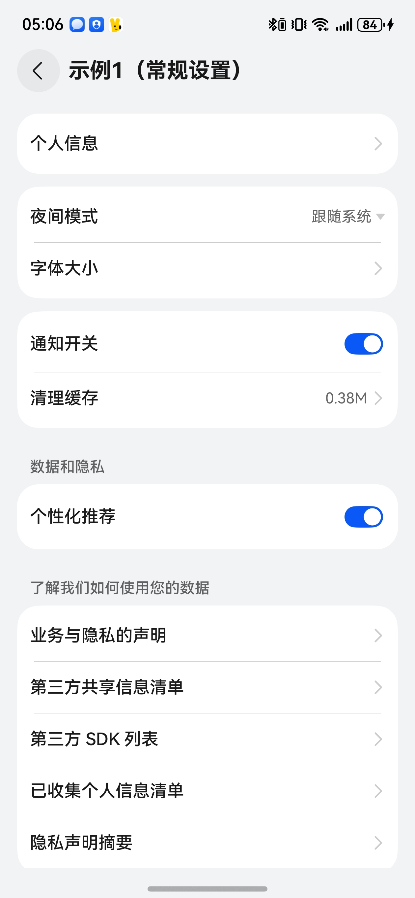</td>
      <td valign='top'>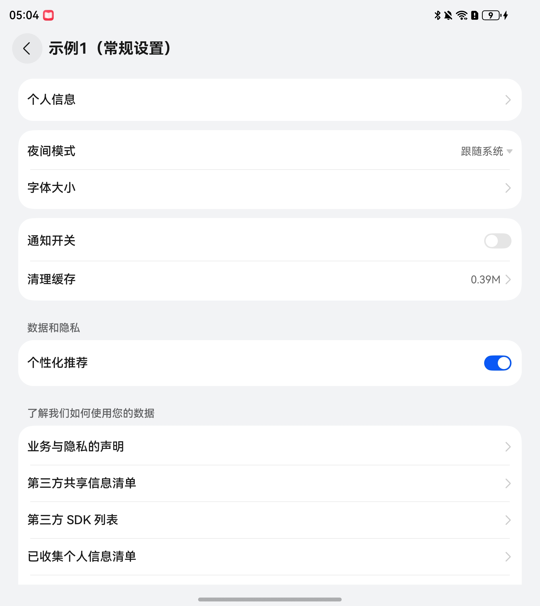</td>
      <td valign='top'>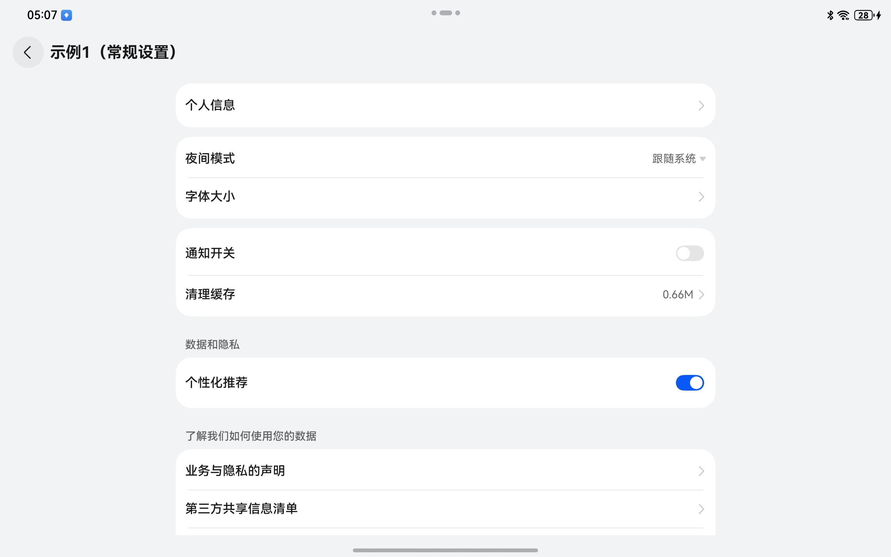</td>
    </tr>
    <tr>
      <th scope='row'>半模态</th>
      <td valign='top'>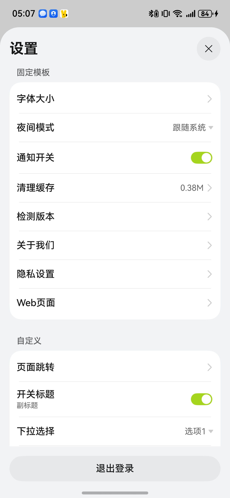</td>
      <td valign='top'>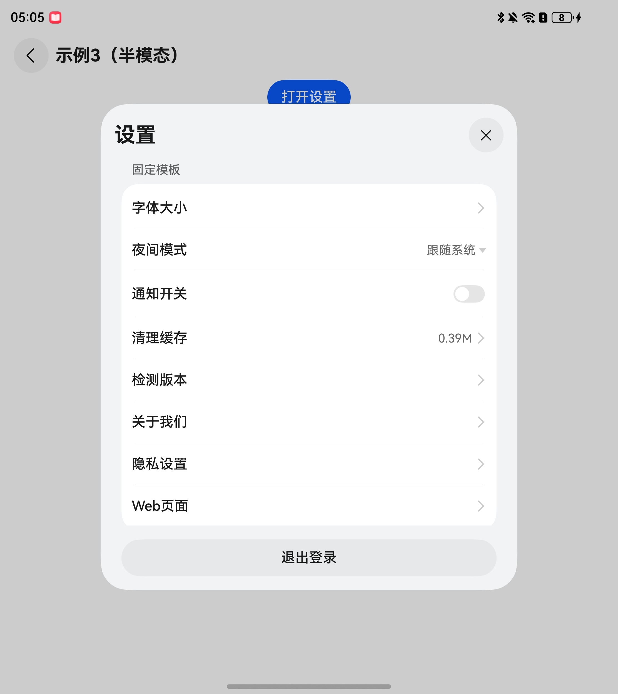</td>
      <td valign='top'>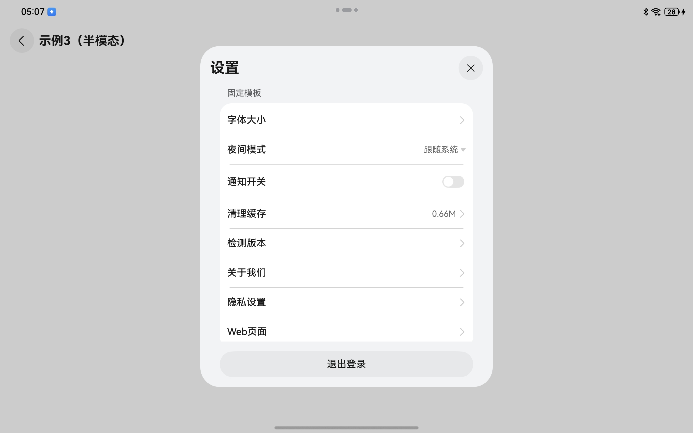</td>
    </tr>
    <tr>
      <th scope='row'>大字体</th>
      <td valign='top'>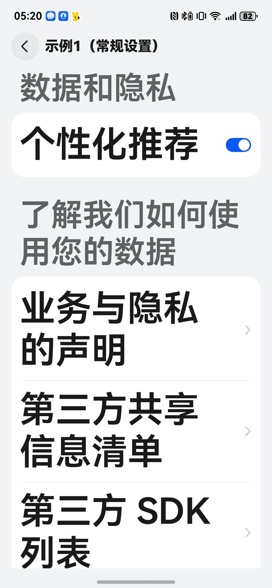</td>
      <td valign='top'>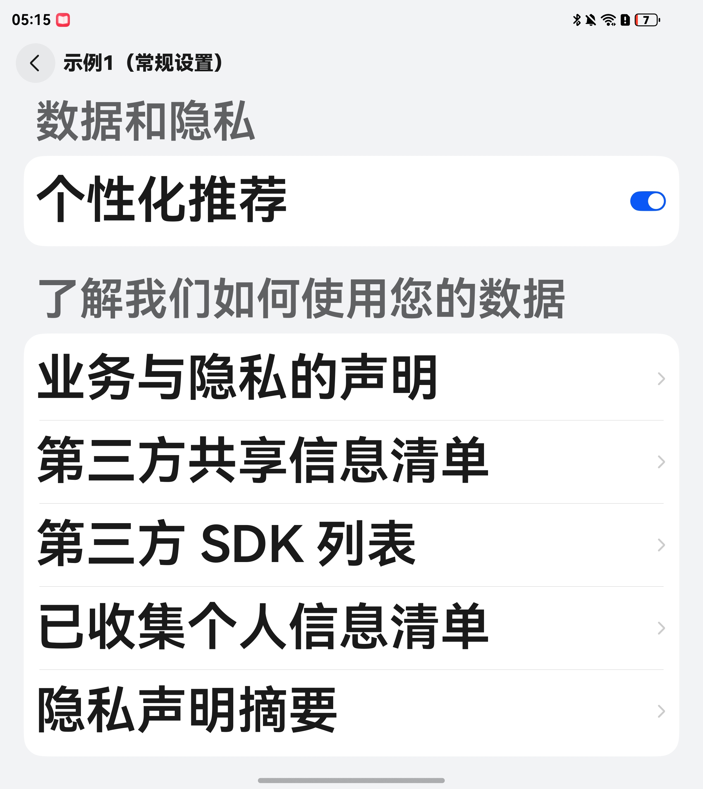</td>
      <td valign='top'>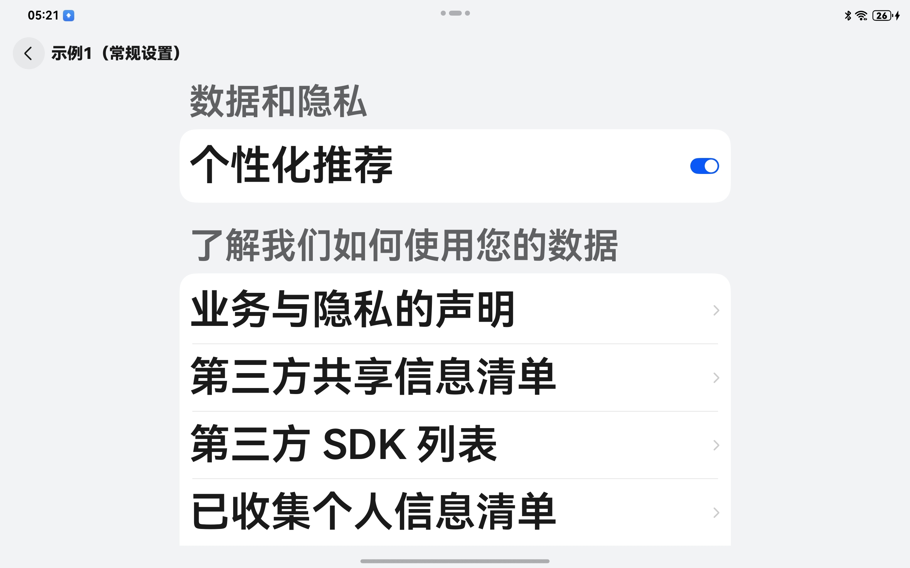</td>
    </tr>
    <tr>
      <th scope='row'>深色模式</th>
      <td valign='top'>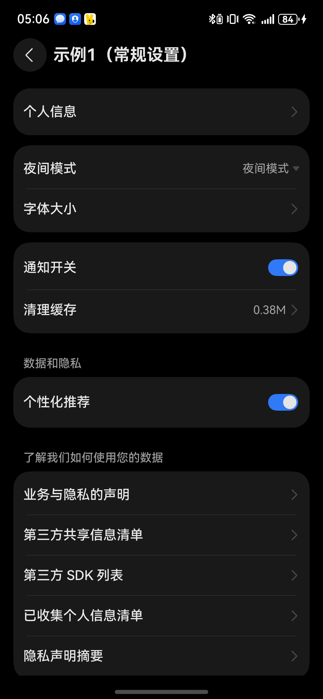</td>
      <td valign='top'>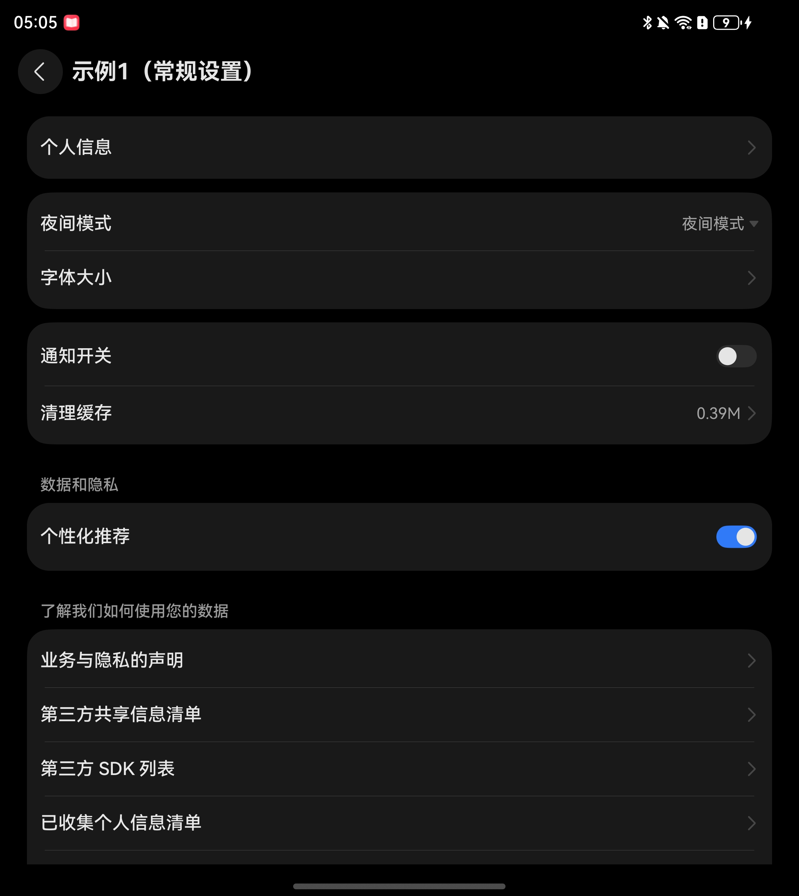</td>
      <td valign='top'>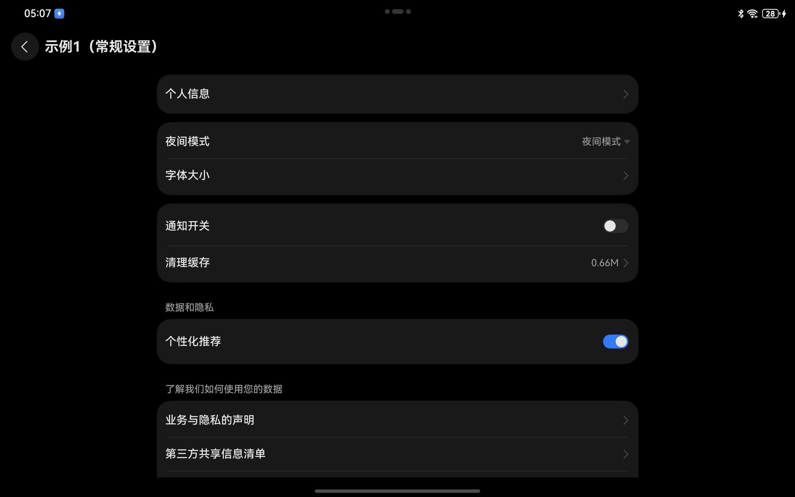</td>
    </tr>
  </table>
</div>

## 约束与限制

### 环境

- DevEco Studio版本：DevEco Studio 5.0.5 Release及以上
- HarmonyOS SDK版本：HarmonyOS 5.0.5 Release SDK及以上
- 设备类型：华为手机（包括双折叠和阔折叠）、平板
- 系统版本：HarmonyOS 5.0.1(13)及以上

### 权限

无

## 快速入门

1. 安装组件。

   如果是在DevEco Studio使用插件集成组件，则无需安装组件，请忽略此步骤。

   如果是从生态市场下载组件，请参考以下步骤安装组件。

   a. 解压下载的组件包，将包中所有文件夹拷贝至您工程根目录的XXX目录下。

   b. 在项目根目录build-profile.json5添加app_setting模块。

   ```
   // 项目根目录下build-profile.json5填写app_setting路径。其中XXX为组件存放的目录名
   "modules": [
     {
       "name": "app_setting",
       "srcPath": "./XXX/app_setting"
     }
   ]
   ```

   c. 在项目根目录oh-package.json5添加依赖。
   ```
   // XXX为组件存放的目录名称
   "dependencies": {
     "app_setting": "file:./XXX/app_setting"
   }
   ```

2. 引入组件。

    ```
    import { SettingItem, SettingGroup, SettingType, SettingView } from 'app_setting'
    ```

3. 调用组件，详细参数配置说明参见[API参考](#API参考)。

4. 如果使用字体大小-跟随系统的能力，需要完成以下步骤，更多参数含义参考[配置configuration标签](https://developer.huawei.com/consumer/cn/doc/harmonyos-guides/app-configuration-file#configuration%E6%A0%87%E7%AD%BE)。

   a. 在项目根目录AppScope/resources/base/profile下面新增配置文件configuration.json。
   ```
   {
     "configuration": {
       "fontSizeScale": "followSystem",
       "fontSizeMaxScale": "3.2"
     }
   }
   ```
   
   b. 在项目根目录AppScope/app.json5中配置configuration字段。
   ```
   {
     "app": {
       "bundleName": "com.example.xxx",
       "vendor": "example",
       "versionCode": 1000000,
       "versionName": "1.0.0",
       "icon": "$media:app_layered_image",
       "label": "$string:app_name",
       "configuration": "$profile:configuration"
     }
   }
   ```

## API参考

### 接口

SettingView(option?: [SettingViewOptions](#SettingViewOptions对象说明))

应用内设置组件

**参数：**

| 参数名     | 类型                                            | 是否必填 | 说明          |
|:--------|:----------------------------------------------|:-----|:------------|
| options | [SettingViewOptions](#SettingViewOptions对象说明) | 否    | 应用内设置组件的参数。 |

### SettingViewOptions对象说明

| 参数名         | 类型                                                                                                                              | 是否必填 | 说明                       |
|:------------|:--------------------------------------------------------------------------------------------------------------------------------|:-----|:-------------------------|
| settingList | [SettingGroup](#SettingGroup)[]                                                                                                 | 是    | 列表数组，默认值[]               |
| pathStack   | [NavPathStack](https://developer.huawei.com/consumer/cn/doc/harmonyos-references/ts-basic-components-navigation#navpathstack10) | 是    | 路由栈                      |
| displayType | [DisplayType](#DisplayType枚举说明)                                                                                                 | 否    | 展示形式，默认值DisplayType.PAGE |
| themeColor  | ResourceColor                                                                                                                   | 否    | 主题色，默认值#0A59F7           |
| pagePadding | Padding                                                                                                                         | 否    | 页面内边距                    |
| isLogin     | boolean                                                                                                                         | 否    | 是否已登录                    |
| signOutApi  | () => Promise<void>                                                                                                             | 否    | 退出登录api                  |

---

SettingCard(option?: [SettingCardOptions](#SettingCardOptions对象说明))

设置卡片

**参数：**

| 参数名     | 类型                                            | 是否必填 | 说明       |
|:--------|:----------------------------------------------|:-----|:---------|
| options | [SettingCardOptions](#SettingCardOptions对象说明) | 否    | 设置卡片的参数。 |

### SettingCardOptions对象说明

| 参数名               | 类型                            | 是否必填 | 说明           |
|:------------------|:------------------------------|:-----|:-------------|
| title             | ResourceStr                   | 否    | 卡片标题         |
| list              | [SettingItem](#SettingItem)[] | 是    | 卡片列表数据       |
| titleSize         | number                        | 否    | 卡片标题文字字号     |
| labelSize         | number                        | 否    | 列表项左侧主标题文字字号 |
| subLabelSize      | number                        | 否    | 列表项左侧副标题文字字号 |
| textSize          | number                        | 否    | 列表项右侧文字字号    |
| enableLaneSetting | boolean                       | 否    | 是否支持分栏       |

---

### SettingGroup

设置组合

#### constructor

constructor()

创建设置组合对象

#### setGroupId

setGroupId(id: string): SettingGroup

设置组合id

#### setTitle

setTitle(title: ResourceStr): SettingGroup

设置组合标题

#### setList

setList(list: [SettingItem](#SettingItem)[]): SettingGroup

设置组合列表

---

### SettingItem

设置项

#### constructor

constructor()

创建设置项对象

#### setItemId

setItemId(id: string): SettingItem

设置项id

#### setType

setType(type: [SettingType](#SettingType枚举说明)): SettingItem

设置项类型

#### setSupportedType

setSupportedType(supportedType: [SupportedSetting](#SupportedSetting枚举说明)): SettingItem

设置已支持的设置类型

#### setExtraParams

setExtraParams(extraParams?: Object): SettingItem

设置附加参数，入参类型可选[AgreementModel](#AgreementModel)、[AboutModel](#AboutModel)、[IFontModel](#IFontModel)、[WebModel](#WebModel)

#### setLabel

setLabel(label: ResourceStr): SettingItem

设置左侧主标题

#### setSubLabel

setSubLabel(subLabel: ResourceStr): SettingItem

设置左侧副标题

#### setRouterParam

setRouterParam(routerParam: [IRouterParams](#IRouterParams)): SettingItem

设置路由参数

#### setSwitchValue

setSwitchValue(switchV: boolean): SettingItem

设置开关的值

#### setSelectIndex

setSelectIndex(selectIndex: number): SettingItem

设置已选索引

#### setSelectOptions

setSelectOptions(selectOptions: [ISelectOption](#ISelectOption)[]): SettingItem

设置选项列表

#### setAutoClose

setAutoClose(autoClose: boolean): SettingItem

设置在选择结束后，是否自动关闭跟手popup

#### setShowPop

setShowPop(showPop: boolean): SettingItem

设置跟手弹窗是否显示

#### setNormalText

setNormalText(normalText: ResourceStr): SettingItem

设置右侧文本

#### setClickEvent

setClickEvent(func: (param?: Object) => void): SettingItem

设置点击事件回调

#### setSelectEvent

setSelectEvent(func: (index: number) => void): SettingItem

设置选择回调

#### setOnChange

setOnChange(func: (param?: Object) => void): SettingItem

设置变化回调

---

### 工具方法

#### fp2pxUtil

fp2pxUtil(fp: number): string

fp单位转换成px单位

---

### DisplayType枚举说明

| 名称    | 说明  |
|:------|:----|
| PAGE  | 页面  |
| SHEET | 半模态 |

### SettingType枚举说明

| 名称     | 说明   |
|:-------|:-----|
| ROUTER | 页面跳转 |
| SWITCH | 切换开关 |
| SELECT | 下拉选择 |
| TEXT   | 文本展示 |

### SupportedSetting枚举说明

| 名称              | 说明   |
|:----------------|:-----|
| PRIVACY         | 隐私设置 |
| PUSH_SWITCH     | 推送开关 |
| CLEAR_CACHE     | 清除缓存 |
| LIGHT_DARK_MODE | 夜间模式 |
| FONT_SIZE       | 字体大小 |
| CHECK_VERSION   | 检测版本 |
| ABOUT           | 关于   |
| WEB             | H5页面 |

### IRouterParams

| 参数名          | 类型         | 是否必填 | 说明                             |
|:-------------|:-----------|:-----|:-------------------------------|
| routerName   | string     | 是    | NavDestination页面名称。            |
| routerParams | Object     | 否    | NavDestination页面详细参数。          |
| onPop        | () => void | 否    | Callback回调，用于页面出栈时触发该回调处理返回结果。 |
| animated     | boolean    | 否    | 是否支持转场动画，默认值true               |

### ISelectOption

| 参数名   | 类型               | 是否必填 | 说明     |
|:------|:-----------------|:-----|:-------|
| id    | number \| string | 是    | 唯一标识id |
| label | string           | 是    | 文本值    |
| value | Object           | 否    | 内容值    |

### AgreementModel

| 参数名                | 类型     | 是否必填 | 说明        |
|:-------------------|:-------|:-----|:----------|
| userAgreement      | string | 是    | 用户协议      |
| privacyPolicy      | string | 是    | 隐私政策      |
| thirtyItem         | string | 是    | 第三方信息共享清单 |
| personalCollection | string | 是    | 个人信息收集清单  |

### AboutModel

| 参数名           | 类型          | 是否必填 | 说明   |
|:--------------|:------------|:-----|:-----|
| icpText       | ResourceStr | 是    | 备案文本 |
| copyrightText | ResourceStr | 是    | 版权文本 |
| hotline       | string      | 是    | 热线电话 |

### IFontModel

| 参数名           | 类型                                                                       | 是否必填 | 说明         |
|:--------------|:-------------------------------------------------------------------------|:-----|:-----------|
| followSystem  | boolean                                                                  | 否    | 字体大小跟随系统设置 |
| fontSizeRatio | number                                                                   | 否    | 自定义字体缩放倍数  |
| onChange      | (followSystem: boolean, fontSizeRatio: number, sysFontSizeScale: number) | 否    | 字体参数变化的回调  |

### WebModel

| 参数名 | 类型                 | 是否必填 | 说明      |
|:----|:-------------------|:-----|:--------|
| src | string \| Resource | 是    | Web资源地址 |

## 示例代码

### 示例1（常规设置）

```ts
import {
  AboutModel,
  SettingItem,
  SettingGroup,
  SettingType,
  SettingView,
  SupportedSetting,
  WebModel,
} from 'app_setting'

@Entry
@ComponentV2
struct AppSettingSample1 {
@Local navPathStack: NavPathStack = new NavPathStack();
  @Local group1: SettingGroup = new SettingGroup()
    .setList([
      new SettingItem()
        .setType(SettingType.ROUTER)
        .setLabel('个人信息')
        .setRouterParam({ routerName: 'PersonalSample1' }),
    ])
  @Local group2: SettingGroup = new SettingGroup()
    .setList([
      new SettingItem()
        .setSupportedType(SupportedSetting.LIGHT_DARK_MODE)
        .setSelectIndex(0)
        .setOnChange((colorMode) => {
          // 获取当前应用深浅色模式：colorMode as ConfigurationConstant.ColorMode
        }),
      new SettingItem()
        .setSupportedType(SupportedSetting.FONT_SIZE),
    ])
  @Local group3: SettingGroup = new SettingGroup()
    .setList([
      new SettingItem()
        .setSupportedType(SupportedSetting.PUSH_SWITCH)
        .setOnChange((isOn) => {
          // 获取推送开关情况：isOn as boolean
        }),
      new SettingItem()
        .setSupportedType(SupportedSetting.CLEAR_CACHE),
    ])
  @Local recommendItem: SettingItem = new SettingItem()
    .setType(SettingType.SWITCH)
    .setLabel('个性化推荐')
    .setSwitchValue(true)
    .setClickEvent((isOn) => {
      this.recommendItem.setSwitchValue(isOn as boolean);
    })
  @Local group4: SettingGroup = new SettingGroup()
    .setTitle('数据和隐私')
    .setList([
      this.recommendItem,
    ])
  @Local group5: SettingGroup = new SettingGroup()
    .setTitle('了解我们如何使用您的数据')
    .setList([
      new SettingItem()
        .setSupportedType(SupportedSetting.WEB)
        .setLabel('业务与隐私的声明')
        .setExtraParams({ src: 'https://www.example.com' } as WebModel),
      new SettingItem()
        .setSupportedType(SupportedSetting.WEB)
        .setLabel('第三方共享信息清单')
        .setExtraParams({ src: 'https://www.example.com' } as WebModel),
      new SettingItem()
        .setSupportedType(SupportedSetting.WEB)
        .setLabel('第三方 SDK 列表')
        .setExtraParams({ src: 'https://www.example.com' } as WebModel),
      new SettingItem()
        .setSupportedType(SupportedSetting.WEB)
        .setLabel('已收集个人信息清单')
        .setExtraParams({ src: 'https://www.example.com' } as WebModel),
      new SettingItem()
        .setSupportedType(SupportedSetting.WEB)
        .setLabel('隐私声明摘要')
        .setExtraParams({ src: 'https://www.example.com' } as WebModel),
    ])
  @Local group6: SettingGroup = new SettingGroup()
    .setTitle('更多')
    .setList([
      new SettingItem()
        .setSupportedType(SupportedSetting.CHECK_VERSION),
      new SettingItem()
        .setSupportedType(SupportedSetting.ABOUT)
        .setExtraParams({
          icpText: '苏ICP备17040376号-135A',
          copyrightText: '华为xx 版权所有 © 2019-2025',
          hotline: '00000000',
        } as AboutModel),
      new SettingItem()
        .setSupportedType(SupportedSetting.WEB)
        .setLabel('服务协议与规则')
        .setExtraParams({ src: 'https://www.example.com' } as WebModel),
    ])

  build() {
    Navigation(this.navPathStack) {
      Column() {
        SettingView({
          pathStack: this.navPathStack,
          settingList: [this.group1, this.group2, this.group3, this.group4, this.group5, this.group6],
        })
      }
      .width('100%')
      .height('100%')
    }
    .title('示例1（常规设置）')
    .backgroundColor($r('sys.color.background_secondary'))
    .mode(NavigationMode.Stack)
  }
}
```

### 示例2（自定义用法介绍）

```ts
import { SettingItem, SettingGroup, SettingType, SettingView } from 'app_setting'

@Entry
@ComponentV2
struct AppSettingSample2 {
  @Local navPathStack: NavPathStack = new NavPathStack();
  @Local routerItem1: SettingItem = new SettingItem()
    .setType(SettingType.ROUTER)
    .setLabel('个人信息')
    .setRouterParam({ routerName: 'PersonalSample1' });
  @Local switchItem1: SettingItem = new SettingItem()
    .setType(SettingType.SWITCH)
    .setLabel('使用移动网络改善内容浏览体验')
    .setSubLabel('如Wi-Fi网络质量差，将使用移动网络改善')
    .setSwitchValue(true)
    .setClickEvent((isOn) => {
      this.switchItem1.setSwitchValue(isOn as boolean)
    })
  @Local switchItem2: SettingItem = new SettingItem()
    .setType(SettingType.SWITCH)
    .setLabel('视频自动下滑')
    .setSubLabel('视频观看结束将自动下滑至下一个视频')
    .setSwitchValue(true)
    .setClickEvent((isOn) => {
      this.switchItem2.setSwitchValue(isOn as boolean)
    })
  @Local switchItem3: SettingItem = new SettingItem()
    .setType(SettingType.SWITCH)
    .setLabel('推荐频道自动播放视频')
    .setSwitchValue(true)
    .setClickEvent((isOn) => {
      this.switchItem3.setSwitchValue(isOn as boolean)
    })
  @Local selectItem1: SettingItem = new SettingItem()
    .setType(SettingType.SELECT)
    .setLabel('非WLAN网络流量')
    .setSelectOptions([
      {
        id: 0,
        label: '最佳效果（下载大图）',
      },
      {
        id: 1,
        label: '较省流量（智能下载）',
      },
      {
        id: 2,
        label: '极省流量（不下载图）',
      },
    ])
    .setSelectIndex(0)
    .setSelectEvent((index: number) => {
      // 回调当前的选择序号: index
    })
  @Local selectItem2: SettingItem = new SettingItem()
    .setType(SettingType.SELECT)
    .setLabel('非WLAN网络播放提醒')
    .setSelectOptions([
      {
        id: 0,
        label: '提醒一次',
      },
      {
        id: 1,
        label: '每次提醒',
      },
    ])
    .setSelectIndex(1)
    .setSelectEvent((index: number) => {
      // 回调当前的选择序号: index
    })
  @Local textItem1: SettingItem = new SettingItem()
    .setType(SettingType.TEXT)
    .setLabel('内容更新')
    .setNormalText('否')
    .setClickEvent(() => {
      this.textItem1.setNormalText(this.textItem1.normalText === '否' ? '是' : '否');
    });
  @Local textItem2: SettingItem = new SettingItem()
    .setType(SettingType.TEXT)
    .setLabel('点击行为')
    .setClickEvent(() => {
      this.getUIContext().getPromptAction().showToast({ message: '+1' });
    })
  @Local group1: SettingGroup = new SettingGroup()
    .setTitle('页面跳转')
    .setList([
      this.routerItem1,
    ])
  @Local group2: SettingGroup = new SettingGroup()
    .setTitle('切换开关')
    .setList([
      this.switchItem1,
      this.switchItem2,
      this.switchItem3,
    ])
  @Local group3: SettingGroup = new SettingGroup()
    .setTitle('弹窗选择')
    .setList([
      this.selectItem1,
      this.selectItem2,
    ])
  @Local group4: SettingGroup = new SettingGroup()
    .setTitle('文本展示')
    .setList([
      this.textItem1,
      this.textItem2,
    ])

  build() {
    Navigation(this.navPathStack) {
      Column() {
        SettingView({
          pathStack: this.navPathStack,
          settingList: [this.group1, this.group2, this.group3, this.group4],
        })
      }
      .width('100%')
      .height('100%')
    }
    .title('示例2（自定义用法介绍）')
    .backgroundColor($r('sys.color.background_secondary'))
    .mode(NavigationMode.Stack)
  }
}
```

### 示例3（半模态）

```ts
import {
  SettingItem,
  SettingGroup,
  SettingType,
  SettingView,
  SupportedSetting,
  AgreementModel,
  AboutModel,
  IFontModel,
  DisplayType,
  WebModel,
} from 'app_setting'

@Entry
@ComponentV2
struct AppSettingSample3 {
  @Local showSheet: boolean = false;
  @Local type: SheetType = SheetType.BOTTOM;

  build() {
    NavDestination() {
      Column() {
        Button('打开设置')
          .onClick(() => {
            this.showSheet = true;
          })
          .bindSheet($$this.showSheet, this.sheetBuilder(), {
            showClose: true,
            height: SheetSize.LARGE,
            preferType: SheetType.CENTER,
            onTypeDidChange: (type: SheetType) => {
              this.type = type;
            },
          })
      }
    }
    .title('示例3（半模态）')
  }

  @Builder
  sheetBuilder() {
    SheetView({
      type: this.type,
    })
  }
}

@ComponentV2
struct SheetView {
  @Param type: SheetType = SheetType.BOTTOM;
  @Local sheetStack: NavPathStack = new NavPathStack();
  @Local routerItem1: SettingItem = new SettingItem()
    .setType(SettingType.ROUTER)
    .setLabel('页面跳转')
    .setRouterParam({ routerName: 'PersonalSample1' });
  @Local switchItem1: SettingItem = new SettingItem()
    .setType(SettingType.SWITCH)
    .setLabel('开关标题')
    .setSubLabel('副标题')
    .setSwitchValue(true)
    .setClickEvent((isOn) => {
      this.switchItem1.setSwitchValue(isOn as boolean)
    })
  @Local selectItem1: SettingItem = new SettingItem()
    .setType(SettingType.SELECT)
    .setLabel('下拉选择')
    .setSelectOptions([
      {
        id: 0,
        label: '选项1',
      },
      {
        id: 1,
        label: '选项2',
      },
      {
        id: 2,
        label: '选项3',
      },
    ])
    .setSelectIndex(0)
    .setSelectEvent((index: number) => {
      // 回调当前的选择序号: index
    })
  @Local textItem1: SettingItem = new SettingItem()
    .setType(SettingType.TEXT)
    .setLabel('文本展示')
    .setNormalText('待更新')
    .setClickEvent(() => {
      this.textItem1.setNormalText('已更新');
    });
  @Local group1: SettingGroup = new SettingGroup()
    .setTitle('固定模板')
    .setList([
      new SettingItem()
        .setSupportedType(SupportedSetting.FONT_SIZE)
        .setExtraParams({
          followSystem: false,
          fontSizeRatio: 1,
          onChange: (followSystem: boolean, fontSizeRatio: number, sysFontSizeScale: number) => {
            // 回调调整后的字体大小设置值
          },
        } as IFontModel),
      new SettingItem()
        .setSupportedType(SupportedSetting.LIGHT_DARK_MODE)
        .setSelectIndex(0)
        .setOnChange((colorMode) => {
          // 回调当前深浅色模式
        }),
      new SettingItem()
        .setSupportedType(SupportedSetting.PUSH_SWITCH)
        .setOnChange((isOn) => {
          // 回调当前推送开关情况
        }),
      new SettingItem()
        .setSupportedType(SupportedSetting.CLEAR_CACHE)
        .setOnChange((data) => {
          // 回调当前缓存大小
        }),
      new SettingItem()
        .setSupportedType(SupportedSetting.CHECK_VERSION)
        .setOnChange((updateAvailable) => {
          // 回调是否有待更新的版本
        }),
      new SettingItem()
        .setSupportedType(SupportedSetting.ABOUT)
        .setExtraParams({
          icpText: '苏ICP备17040376号-135A',
          copyrightText: '华为xx 版权所有 © 2019-2025',
          hotline: '00000000',
        } as AboutModel),
      new SettingItem()
        .setSupportedType(SupportedSetting.PRIVACY)
        .setExtraParams({
          userAgreement: 'https://www.example.com',
          privacyPolicy: 'https://www.example.com',
          thirtyItem: 'https://www.example.com',
          personalCollection: 'https://www.example.com',
        } as AgreementModel),
      new SettingItem()
        .setLabel('Web页面')
        .setSupportedType(SupportedSetting.WEB)
        .setExtraParams({
          src: 'https://www.example.com',
        } as WebModel),
    ])
  @Local group2: SettingGroup = new SettingGroup()
    .setTitle('自定义')
    .setList([
      this.routerItem1,
      this.switchItem1,
      this.selectItem1,
      this.textItem1,
    ])

  build() {
    Navigation(this.sheetStack) {
      Column() {
        Text('设置')
          .fontSize('24vp')
          .fontColor($r('sys.color.font_primary'))
          .fontWeight(FontWeight.Bold)
          .height(56)
          .alignSelf(ItemAlign.Start)
          .margin({ left: 16, top: 8 })

        SettingView({
          pathStack: this.sheetStack,
          displayType: DisplayType.SHEET,
          themeColor: $r('sys.color.multi_color_05'),
          isLogin: true,
          signOutApi: () => {
            return new Promise((resolve) => {
              resolve();
            });
          },
          pagePadding: {
            bottom: this.type === SheetType.BOTTOM ? 28 : 16,
          },
          settingList: [this.group1, this.group2],
        })
          .layoutWeight(1)
      }
      .width('100%')
      .height('100%')
    }
    .hideTitleBar(true)
    .mode(NavigationMode.Stack)
  }
}
```
