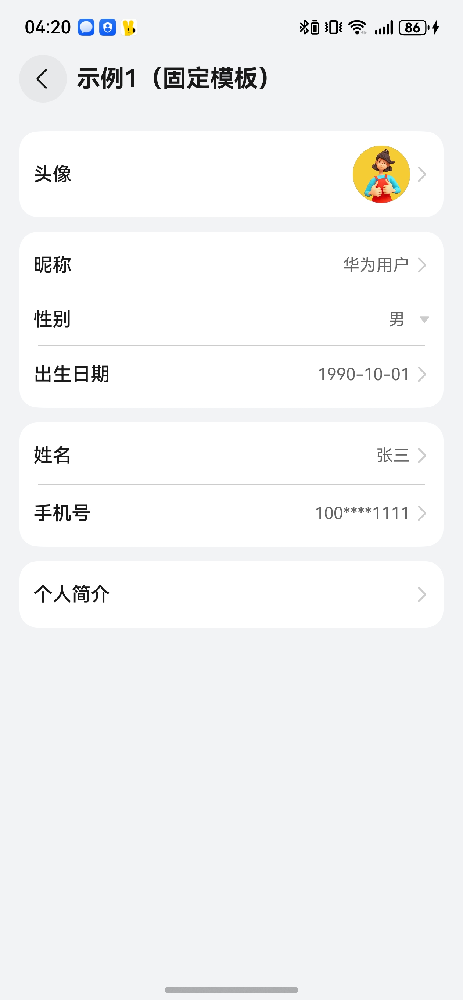
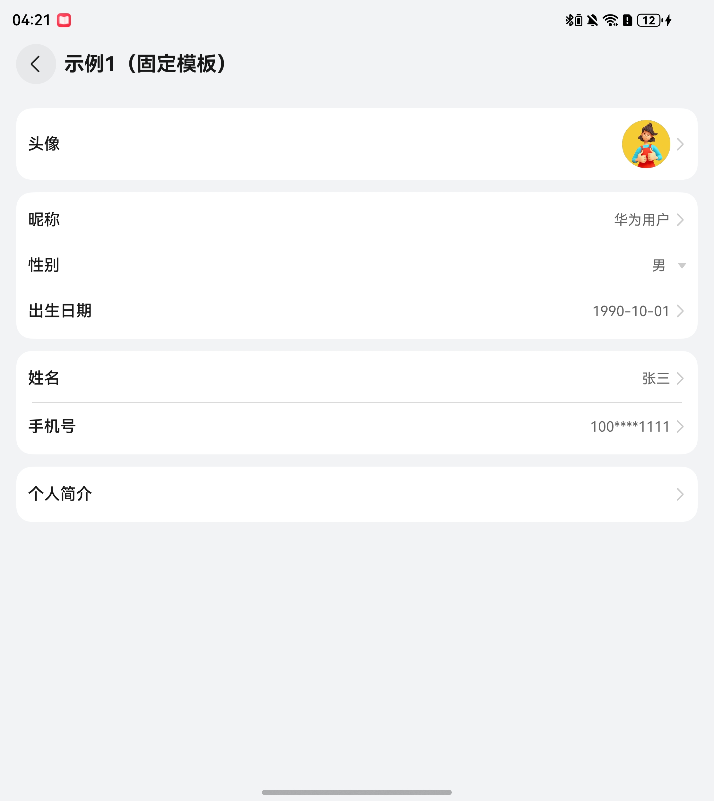
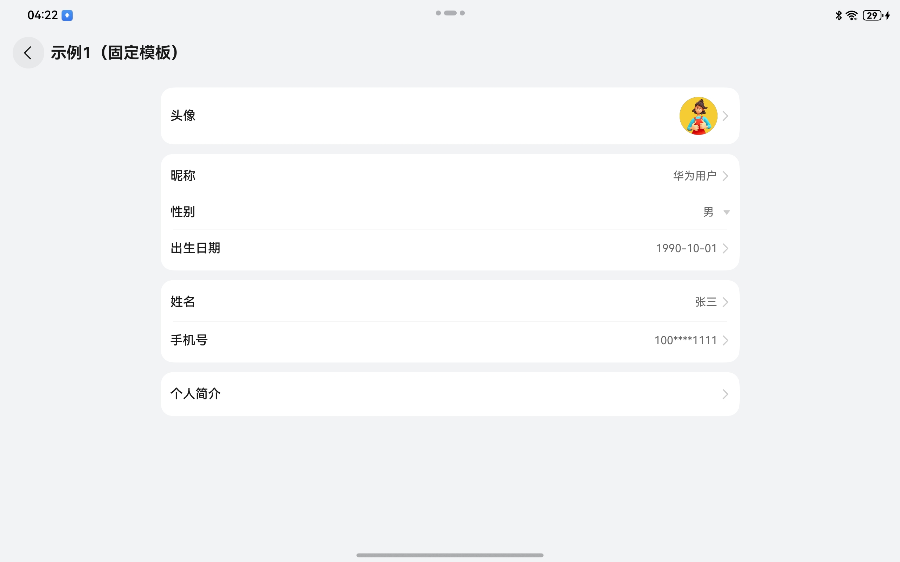
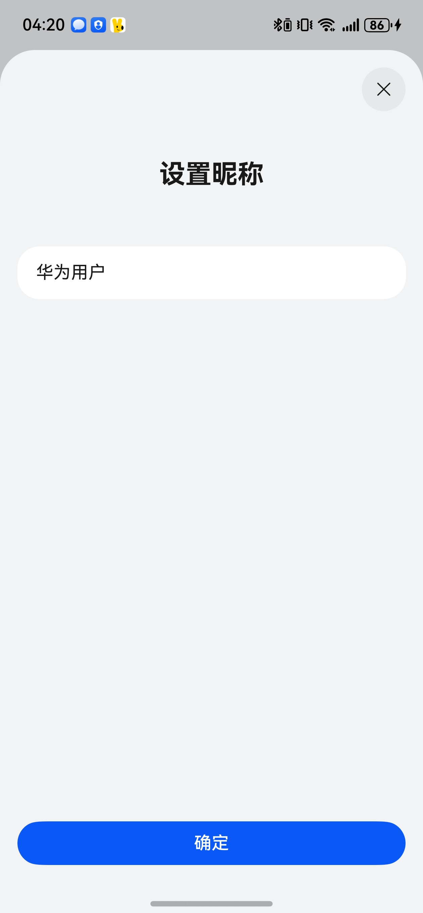
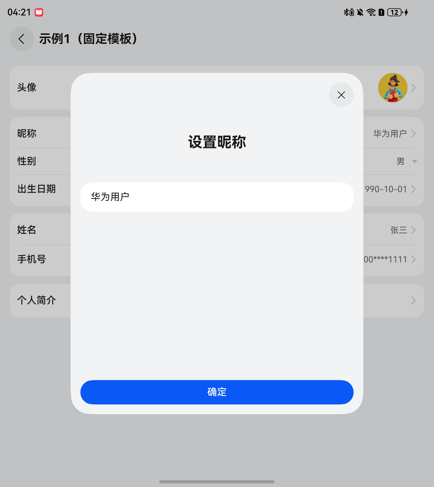
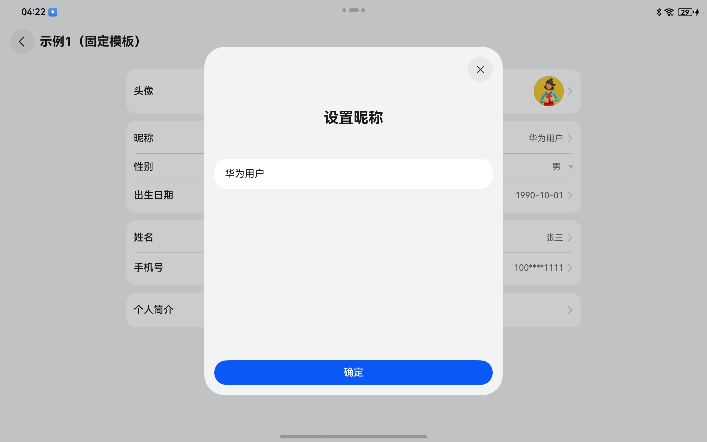

# 通用个人信息组件快速入门

## 目录

- [简介](#简介)
- [约束与限制](#约束与限制)
- [快速入门](#快速入门)
- [API参考](#API参考)
- [示例代码](#示例代码)

## 简介

本组件支持编辑头像、昵称、姓名、性别、手机号、生日、个人简介等。

<div style='overflow-x:auto'>
  <table style='min-width:800px'>
    <tr>
      <th></th>
      <th>直板机</th>
      <th>折叠屏</th>
      <th>平板</th>
    </tr>
    <tr>
      <th scope='row'>列表</th>
      <td valign='top'></td>
      <td valign='top'></td>
      <td valign='top'></td>
    </tr>
    <tr>
      <th scope='row'>编辑</th>
      <td valign='top'></td>
      <td valign='top'></td>
      <td valign='top'></td>
    </tr>
  </table>
</div>

## 约束与限制

### 环境

- DevEco Studio版本：DevEco Studio 5.0.5 Release及以上
- HarmonyOS SDK版本：HarmonyOS 5.0.5 Release SDK及以上
- 设备类型：华为手机（包括双折叠和阔折叠）、平板
- 系统版本：HarmonyOS 5.0.1(13)及以上

### 权限

无

## 快速入门

1. 安装组件。

   如果是在DevEco Studio使用插件集成组件，则无需安装组件，请忽略此步骤。

   如果是从生态市场下载组件，请参考以下步骤安装组件。

   a. 解压下载的组件包，将包中所有文件夹拷贝至您工程根目录的XXX目录下。

   b. 在项目根目录build-profile.json5添加collect_personal_info模块。

   ```
   // 项目根目录下build-profile.json5填写collect_personal_info路径。其中XXX为组件存放的目录名
   "modules": [
     {
       "name": "collect_personal_info",
       "srcPath": "./XXX/collect_personal_info"
     }
   ]
   ```

   c. 在项目根目录oh-package.json5添加依赖。
   ```
   // XXX为组件存放的目录名称
   "dependencies": {
     "collect_personal_info": "file:./XXX/collect_personal_info"
   }
   ```

2. 引入组件。

    ```
    import { PersonalInfo, PersonalInfoView, DataType, SwitchInfo, ApiHandler } from 'collect_personal_info';
    ```

3. 调用组件，详细参数配置说明参见[API参考](#API参考)。

4. 配置华为账号服务，将Client
   ID配置到entry模块下的src/main/module.json5文件，详细参考：[配置Client ID](https://developer.huawei.com/consumer/cn/doc/harmonyos-guides/account-client-id)。

## API参考

### 接口

PersonalInfoView(option?: [PersonalInfoViewOptions](#PersonalInfoViewOptions对象说明))

收集个人信息组件

**参数：**

| 参数名     | 类型                                                      | 是否必填 | 说明           |
|:--------|:--------------------------------------------------------|:-----|:-------------|
| options | [PersonalInfoViewOptions](#PersonalInfoViewOptions对象说明) | 否    | 收集个人信息组件的参数。 |

### PersonalInfoViewOptions对象说明

| 参数名          | 类型                                                                             | 是否必填 | 说明                                                         |
|:-------------|:-------------------------------------------------------------------------------|:-----|:-----------------------------------------------------------|
| list         | [FormGroup](#FormGroup)[]                                                      | 否    | 数据列表，如果数组不为空，personalInfo、apiInfo、switchInfo、onChange等参数失效 |
| personalInfo | [PersonalInfo](#PersonalInfo)                                                  | 否    | 个人信息初始值                                                    |
| apiInfo      | [ApiHandler](#ApiHandler)                                                      | 否    | 云侧接口配置                                                     |
| switchInfo   | [SwitchInfo](#SwitchInfo)                                                      | 否    | 开关配置                                                       |
| themeColor   | string \| Resource                                                             | 否    | 主题色，默认值#0A59F7                                             |
| onChange     | (type: [DataType](#DataType枚举说明), data: [PersonalInfo](#PersonalInfo)) => void | 否    | 个人信息变化的回调函数                                                |

---

### FormGroup

| 参数名  | 类型                                      | 是否必填 | 说明        |
|:-----|:----------------------------------------|:-----|:----------|
| list | [ObservedInfoItem](#ObservedInfoItem)[] | 是    | 单个组合数据列表。 |

### PersonalInfo

| 参数名         | 类型                            | 是否必填 | 说明      |
|:------------|:------------------------------|:-----|:--------|
| avatar      | ResourceStr                   | 否    | 用户头像。   |
| nickName    | ResourceStr                   | 否    | 用户昵称。   |
| fullName    | ResourceStr                   | 否    | 用户姓名。   |
| gender      | [GenderType](#GenderType枚举说明) | 否    | 用户性别。   |
| birthDate   | Date                          | 否    | 用户生日。   |
| phoneNumber | string                        | 否    | 用户手机号码。 |
| introDesc   | ResourceStr                   | 否    | 用户简介描述。 |

### ApiHandler

| 参数名             | 类型                               | 是否必填 | 说明          |
|:----------------|:---------------------------------|:-----|:------------|
| updateAvatar    | (param: Object) => Promise<void> | 否    | 更新用户头像。     |
| updateNickName  | (param: Object) => Promise<void> | 否    | 更新用户昵称。     |
| updateGender    | (param: Object) => Promise<void> | 否    | 更新用户性别。     |
| updateBirth     | (param: Object) => Promise<void> | 否    | 更新用户生日。     |
| updateFullName  | (param: Object) => Promise<void> | 否    | 更新用户姓名。     |
| updatePhoneInfo | [PhoneApiInfo](#PhoneApiInfo)    | 否    | 更新用户手机号码。   |
| updateIntro     | (param: Object) => Promise<void> | 否    | 更新用户个人简介信息。 |

### SwitchInfo

| 参数名             | 类型      | 是否必填 | 说明                 |
|:----------------|:--------|:-----|:-------------------|
| showAvatar      | boolean | 否    | 是否显示用户头像，默认值为true  |
| showNickName    | boolean | 否    | 是否显示用户昵称，默认值为true  |
| showFullName    | boolean | 否    | 是否显示用户姓名，默认值为true  |
| showGender      | boolean | 否    | 是否显示用户性别，默认值为true  |
| showBirthDate   | boolean | 否    | 是否显示用户生日，默认值为true  |
| showPhoneNumber | boolean | 否    | 是否显示用户手机号，默认值为true |
| showIntroDesc   | boolean | 否    | 是否显示用户简介，默认值为true  |

### PhoneApiInfo

| 参数名        | 类型                                             | 是否必填 | 说明             |
|:-----------|:-----------------------------------------------|:-----|:---------------|
| codeLength | number                                         | 否    | 验证码的长度，默认值为6。  |
| sendCode   | (phone: string) => Promise<void>               | 是    | 发送验证码的接口方法。    |
| verifyCode | (phone: string, code: string) => Promise<void> | 是    | 校验验证码正确性的接口方法。 |

### InfoItem

| 参数名              | 类型                                                                                                                                      | 是否必填 | 说明                                       |
|:-----------------|:----------------------------------------------------------------------------------------------------------------------------------------|:-----|:-----------------------------------------|
| type             | [FormType](#FormType枚举说明)                                                                                                               | 是    | 表单字段的类型                                  |
| value            | ResourceStr \| Date \| number \| [GenderType](#GenderType枚举说明)                                                                          | 否    | 表单字段的当前值                                 |
| label            | ResourceStr                                                                                                                             | 是    | 表单字段的主标签，用于说明字段含义。                       |
| subLabel         | ResourceStr                                                                                                                             | 否    | 可选的次级标签，用于补充说明字段用途或提供额外信息。               |
| placeholderText  | ResourceStr                                                                                                                             | 否    | 当字段为空时显示的提示文本。                           |
| validMessageText | ResourceStr                                                                                                                             | 否    | 当字段值有效时显示的提示信息。                          |
| maxLength        | number                                                                                                                                  | 否    | 输入字段支持的最大字符数限制。                          |
| showValue        | boolean                                                                                                                                 | 否    | 是否显示字段当前的值。                              |
| showRightArrow   | boolean                                                                                                                                 | 否    | 是否在字段右侧显示一个箭头图标。                         |
| sheetOptions     | [SheetOptions](https://developer.huawei.com/consumer/cn/doc/harmonyos-references/ts-universal-attributes-sheet-transition#sheetoptions) | 否    | 半模态弹窗参数。                                 |
| invocation       | (param: Object) => Promise<void>                                                                                                        | 否    | 异步函数，用于立即处理表单项提交或数据处理逻辑。                 |
| phoneInfo        | [PhoneApiInfo](#PhoneApiInfo)                                                                                                           | 否    | 更新手机号相关参数，在type为FormType.PHONE_INPUT时必填。 |
| onChange         | (param?: Object) => void                                                                                                                | 否    | 当字段值发生变化时触发的回调函数。                        |
| onClick          | () => void                                                                                                                              | 否    | 当表单项被点击时触发的回调函数。                         |

### ObservedInfoItem

[InfoItem](#InfoItem)的实现类，具有状态监测能力。

### ISelectOption

| 参数名   | 类型               | 是否必填 | 说明    |
|:------|:-----------------|:-----|:------|
| id    | number \| string | 是    | 唯一索引  |
| label | ResourceStr      | 是    | 展示文本  |
| value | Object           | 是    | 内容枚举值 |

### DataType枚举说明

| 名称           | 说明   |
|:-------------|:-----|
| AVATAR       | 头像   |
| NICK_NAME    | 昵称   |
| FULL_NAME    | 姓名   |
| GENDER       | 性别   |
| BIRTH_DATE   | 出生日期 |
| PHONE_NUMBER | 手机号码 |
| INTRO_DESC   | 个人简介 |

### GenderType枚举说明

| 名称              | 说明 |
|:----------------|:---|
| MALE            | 男  |
| FEMALE          | 女  |
| CONFIDENTIALITY | 保密 |

### FormType枚举说明

| 名称            | 说明      |
|:--------------|:--------|
| CHOOSE_AVATAR | 选择头像    |
| TEXT_INPUT    | 单行文本输入框 |
| PHONE_INPUT   | 手机号码输入框 |
| TEXTAREA      | 多行文本输入框 |
| DROP_SELECT   | 下拉选择    |
| DATE_SELECT   | 日期选择    |

## 示例代码

### 示例1（固定模板）

```ts
import { PersonalInfo, PersonalInfoView, DataType, SwitchInfo, ApiHandler, GenderType } from 'collect_personal_info';

@Entry
@ComponentV2
struct PersonalSample1 {
  @Local switchInfo: SwitchInfo = {
    showAvatar: true,
    showNickName: true,
    showFullName: true,
    showGender: true,
    showBirthDate: true,
    showPhoneNumber: true,
    showIntroDesc: true,
  };
  @Local personalInfo: PersonalInfo = {
    avatar: 'https://agc-storage-drcn.platform.dbankcloud.cn/v0/news-hnp2d/avatar%2Favatar_12.jpg',
    nickName: '华为用户',
    gender: GenderType.MALE,
    birthDate: new Date('1990-10-01'),
    fullName: '张三',
    phoneNumber: '10000001111',
    introDesc: '在自己的小世界里，做一个快乐的普通人，把节奏放慢，享受生活！十六岁的青春张扬 十八岁的未来可期，携零零碎碎的美好奔赴未知的将来！',
  };
  @Local apiInfo: ApiHandler = {
    updateAvatar: (param: Object) => new Promise((resolve) => resolve()),
    updateNickName: (param: Object) => new Promise((resolve) => resolve()),
    updateGender: (param: Object) => new Promise((resolve) => resolve()),
    updateBirth: (param: Object) => new Promise((resolve) => resolve()),
    updateFullName: (param: Object) => new Promise((resolve) => resolve()),
    updateIntro: (param: Object) => new Promise((resolve) => resolve()),
    updatePhoneInfo: {
      codeLength: 6,
      sendCode: (phone: string) => {
        return new Promise((resolve, reject) => {
          setTimeout(() => {
            resolve()
          }, 1000)
        })
      },
      verifyCode: (phone: string, code: string) => {
        return new Promise((resolve, reject) => {
          setTimeout(() => {
            resolve()
          }, 1000)
        })
      },
    },
  };

  build() {
    NavDestination() {
      Column() {
        PersonalInfoView({
          switchInfo: this.switchInfo,
          personalInfo: this.personalInfo,
          apiInfo: this.apiInfo,
          onChange: (type: DataType, data: PersonalInfo) => {
            console.log('personal info change, all data: ' + JSON.stringify(data));
          },
        })
      }
      .width('100%')
      .height('100%')
      .padding(16)
    }
    .title('示例1（固定模板）')
    .backgroundColor($r('sys.color.background_secondary'))
  }
}
```

### 示例2（自由组合）

```ts
import { FormGroup, FormType, ObservedInfoItem, PersonalInfoView } from 'collect_personal_info'

@Entry
@ComponentV2
struct PersonalSample2 {
  build() {
    NavDestination() {
      Column() {
        PersonalInfoView({
          list: this.list,
          themeColor: $r('sys.color.multi_color_07'),
        })
      }
      .width('100%')
      .height('100%')
      .padding(16)
    }
    .title('示例2（自由组合）')
    .backgroundColor($r('sys.color.background_secondary'))
  }

  @Local avatarItem: ObservedInfoItem = new ObservedInfoItem({
    type: FormType.CHOOSE_AVATAR,
    label: '头像',
    value: 'https://agc-storage-drcn.platform.dbankcloud.cn/v0/news-hnp2d/avatar%2Favatar_12.jpg',
    onChange: (param?: Object) => {
      this.avatarItem.value = param as string;
    },
  });
  @Local nickNameItem: ObservedInfoItem = new ObservedInfoItem({
    type: FormType.TEXT_INPUT,
    label: '姓名',
    value: '咚咚锵锵',
    minLength: 2,
    maxLength: 10,
    placeholderText: '姓名',
    invocation: (param: Object) => {
      return Promise.resolve();
    },
    validMessageText: '内容为空，请输入后保存',
    onChange: (param?: Object) => {
      this.nickNameItem.value = param as string;
    },
  })
  @Local genderItem: ObservedInfoItem = new ObservedInfoItem({
    type: FormType.DROP_SELECT,
    label: '性别',
    selectOptions: [
      {
        id: 0,
        value: 0,
        label: '男',
      },
      {
        id: 1,
        value: 1,
        label: '女',
      },
      {
        id: 2,
        value: 2,
        label: '保密',
      },
    ],
    value: 2,
    onChange: (param?: Object) => {
      this.genderItem.value = param as number;
    },
  });
  @Local birthItem: ObservedInfoItem = new ObservedInfoItem({
    type: FormType.DATE_SELECT,
    label: '出生日期',
    sheetOptions: {
      height: 500,
    },
    onChange: (param?: Object) => {
      this.birthItem.value = param as Date;
    },
  });
  @Local phoneItem: ObservedInfoItem = new ObservedInfoItem({
    type: FormType.PHONE_INPUT,
    label: '手机号码',
    value: '10000001111',
    phoneInfo: {
      codeLength: 6,
      sendCode: (phone: string) => {
        return new Promise((resolve, reject) => {
          setTimeout(() => {
            resolve()
          }, 1000)
        })
      },
      verifyCode: (phone: string, code: string) => {
        return new Promise((resolve, reject) => {
          setTimeout(() => {
            resolve()
          }, 1000)
        })
      },
    },
    onChange: (param?: Object) => {
      this.phoneItem.value = param as string;
    },
  })
  @Local introItem: ObservedInfoItem = new ObservedInfoItem({
    type: FormType.TEXTAREA,
    maxLength: 50,
    label: '个人简介',
    placeholderText: '简单介绍一下自己吧~~',
    showValue: false,
    onChange: (param?: Object) => {
      this.introItem.value = param as string;
    },
  });
  @Local list: FormGroup[] = [
    {
      list: [this.avatarItem],
    },
    {
      list: [
        this.nickNameItem,
        this.genderItem,
        this.birthItem,
        this.phoneItem,
      ],
    },
    {
      list: [
        this.introItem,
      ],
    },
  ];
}
```
