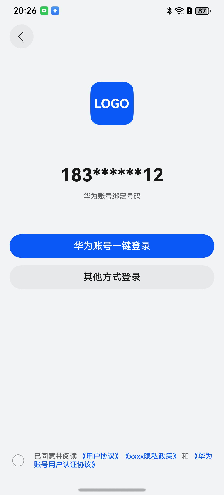
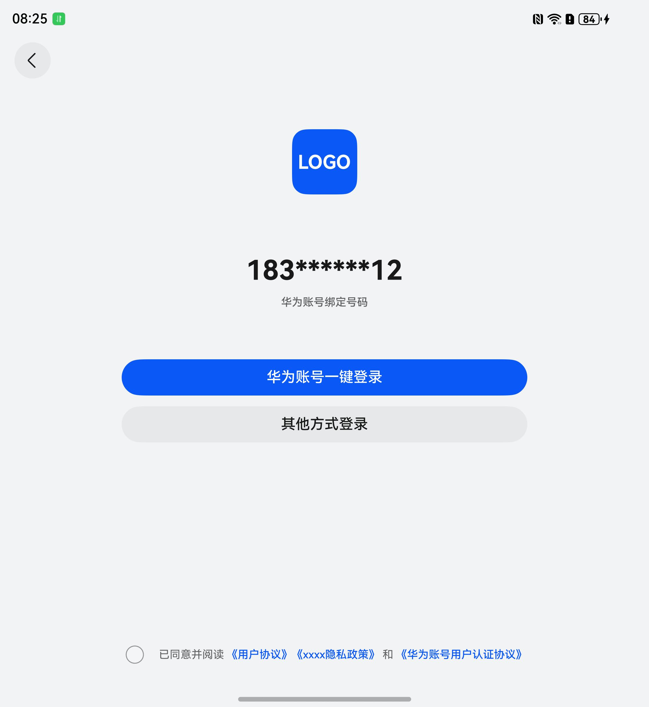
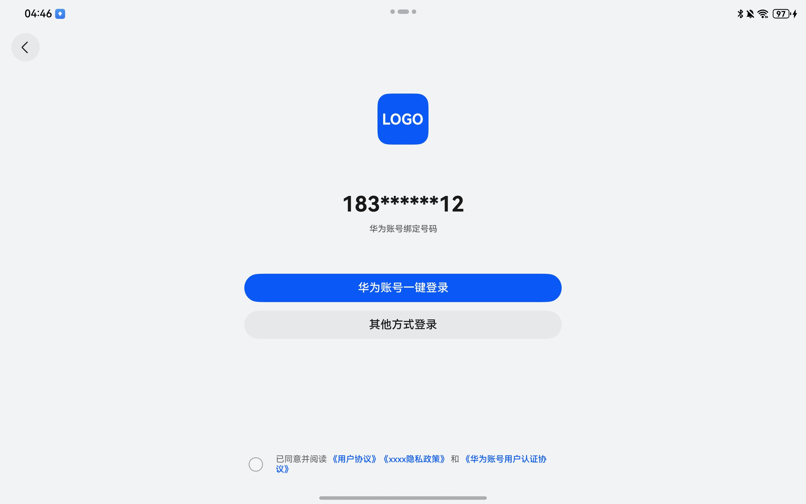
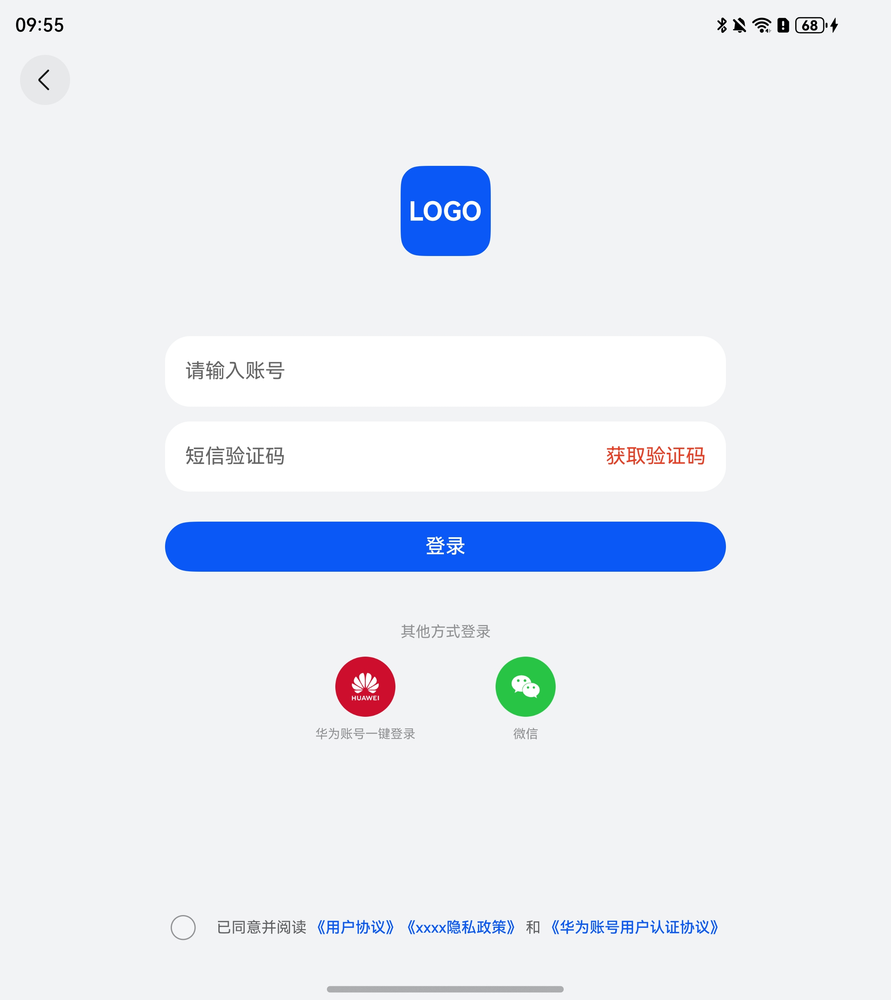
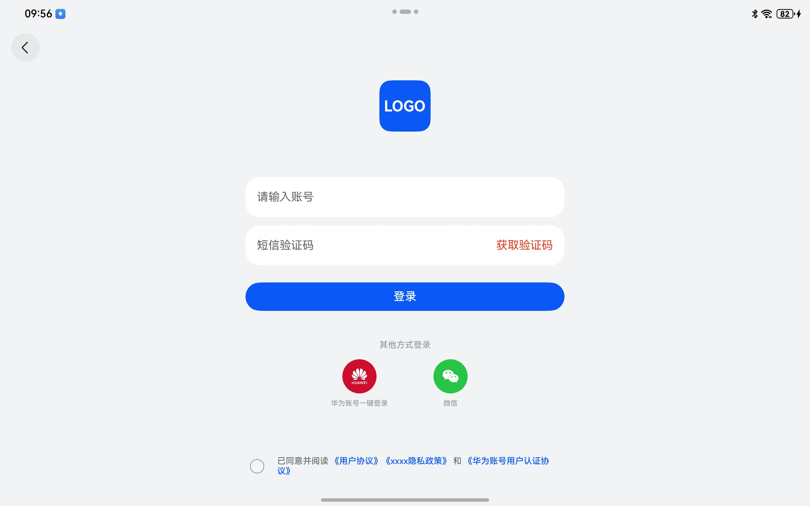
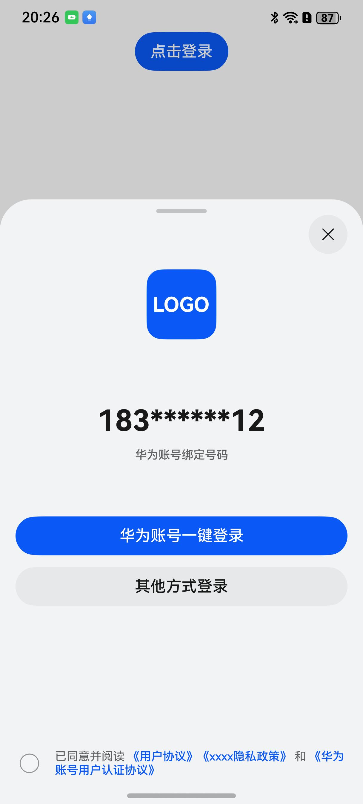
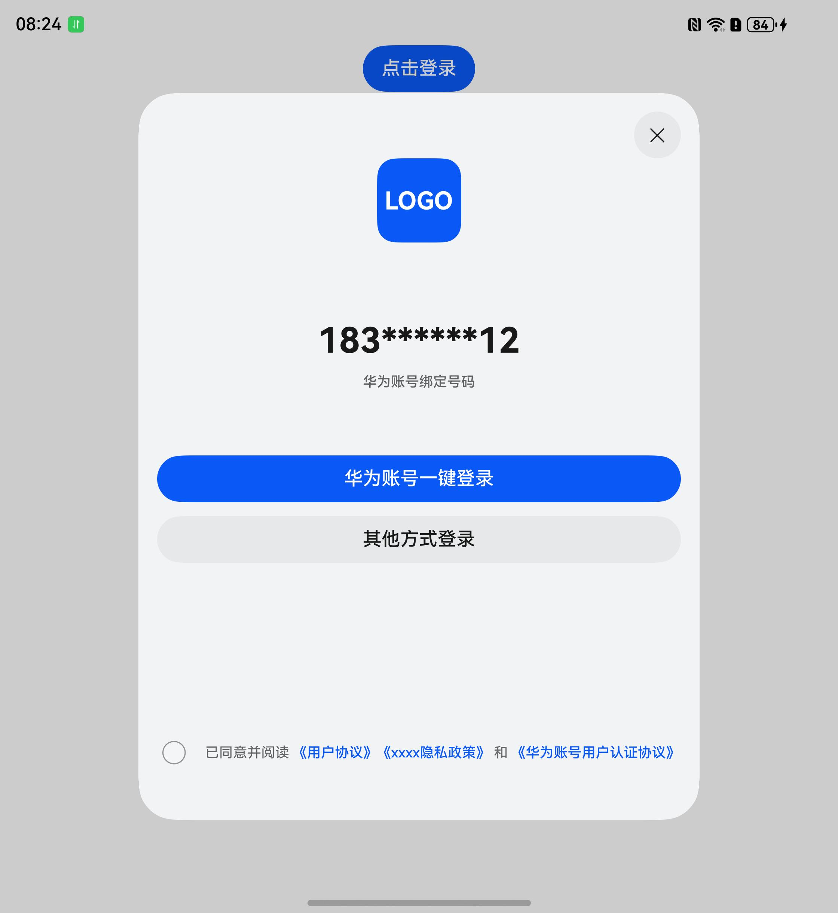

# 通用登录组件快速入门

## 目录

- [简介](#简介)
- [约束与限制](#约束与限制)
- [快速入门](#快速入门)
- [API参考](#API参考)
- [示例代码](#示例代码)

## 简介

本组件提供了华为账号一键登录及其他方式登录（微信、手机号登录），开发者可以根据业务需要快速实现应用登录。

<div style='overflow-x:auto'>
  <table style='min-width:800px'>
    <tr>
      <th></th>
      <th>直板机</th>
      <th>折叠屏</th>
      <th>平板</th>
    </tr>
    <tr>
      <th scope='row'>华为账号登录</th>
      <td valign='top'></td>
      <td valign='top'></td>
      <td valign='top'></td>
    </tr>
    <tr>
      <th scope='row'>其他方式登录</th>
      <td valign='top'></td>
      <td valign='top'></td>
      <td valign='top'></td>
    </tr>
    <tr>
      <th scope='row'>半模态登录</th>
      <td valign='top'></td>
      <td valign='top'></td>
      <td valign='top'></td>
    </tr>
  </table>
</div>

## 约束与限制

### 环境

- DevEco Studio版本：DevEco Studio 5.0.5 Release及以上
- HarmonyOS SDK版本：HarmonyOS 5.0.5 Release SDK及以上
- 设备类型：华为手机（包括双折叠和阔折叠）、华为平板
- 系统版本：HarmonyOS 5.0.1(13) 及以上

### 权限

- 网络权限：ohos.permission.INTERNET

### 注意事项

- 本组件在未配置华为账号一键登录的情况下为保证正常使用，均采用模拟用户信息登录，实际开发中请以具体业务为准。
- 本组件手机号登录中获取验证码场景为模拟场景，真实场景以业务实际场景为准，详情请参考[手机号码](https://developer.huawei.com/consumer/cn/doc/app/agc-help-auth-login-phone-0000002271416141)。

## 快速入门

1. 安装组件。

   如果是在DevEco Studio使用插件集成组件，则无需安装组件，请忽略此步骤。

   如果是从生态市场下载组件，请参考以下步骤安装组件。

   a. 解压下载的组件包，将包中所有文件夹拷贝至您工程根目录的XXX目录下。

   b. 在项目根目录build-profile.json5添加aggregated_login模块。

    ```
    // 在项目根目录build-profile.json5填写aggregated_login路径。其中XXX为组件存放的目录名
    "modules": [
        {
        "name": "aggregated_login",
        "srcPath": "./XXX/aggregated_login",
        }
    ]
    ```
   c. 在项目根目录oh-package.json5中添加依赖。
    ```
    // XXX为组件存放的目录名称
    "dependencies": {
      "aggregated_login": "file:./XXX/aggregated_login"
    }
    ```

2. 配置华为账号服务。

   a. 将应用的client ID配置到entry模块的src/main/module.json5文件，详细参考：[配置Client ID](https://developer.huawei.com/consumer/cn/doc/harmonyos-guides/account-client-id)。

    ```
      "metadata": [
         {
           "name": "client_id",
           "value": "*****"
           // 配置为获取的Client ID
         },
       ],
    ```
   b. [配置签名和指纹](https://developer.huawei.com/consumer/cn/doc/harmonyos-guides/account-sign-fingerprints)。

   c. [申请账号权限](https://developer.huawei.com/consumer/cn/doc/harmonyos-guides/account-config-permissions) 。

3. （可选）接入微信SDK。前往微信开放平台申请AppId并配置鸿蒙应用信息，详情请参考[鸿蒙接入指南](https://developers.weixin.qq.com/doc/oplatform/Mobile_App/Access_Guide/ohos.html)。

4. 引入登录组件句柄。

    ```
    import { AggregatedLogin, Channel, LoginController, LoginChannelType, 
    ApiController, LoginSheetUtils, LoginInfoOptions, LoginParams, LoginType, LoginFailError } from 'aggregated_login';
   ```

5. 在项目的entry模块下src/main/module.json5中添加配置。
   ```
   "querySchemes": [
      "weixin",
      "wxopensdk"
    ],
   ```
6. 在项目的entry模块下src/main/ets/entryability/EntryAbility.ets中初始化SDK和应用回调。
   ```
   import { WXLoginService } from 'aggregated_login';
   
   export default class EntryAbility extends UIAbility {
     // 实例化登录服务
     private loginServiceImpl: WXLoginService =
       WXLoginService.create()
          // todo 填写微信开放平台配置的应用AppID
          .initWX('wxc92d9d6570127a32')
   
     onNewWant(want: Want): void {
       this.loginServiceImpl.handleWant(want);
     }
   
     onCreate(want: Want): void {
       this.loginServiceImpl.handleWant(want);
     }
   }
   ```
7. 调用组件，详细参数配置说明参见[API参考](#API参考)。

## API参考

### 子组件

无

### 接口

AggregatedLogin(options?: LoginInfoOptions)

登录组件。

**参数：**

| 参数名     | 类型                                        | 是否必填 | 说明     |
|:--------|:------------------------------------------|:-----|:-------|
| options | [LoginInfoOptions](#LoginInfoOptions对象说明) | 是    | 登录组件参数 |

### LoginInfoOptions对象说明

| 参数名             | 类型                                                                                                                              | 是否必填 | 说明                                                                                                                              |
|:----------------|:--------------------------------------------------------------------------------------------------------------------------------|:-----|:--------------------------------------------------------------------------------------------------------------------------------|
| icon            | [ResourceStr](https://developer.huawei.com/consumer/cn/doc/harmonyos-references/ts-types#resourcestr)                           | 是    | 应用图标，参考[UX设计规范](https://developer.huawei.com/consumer/cn/doc/harmonyos-guides/account-phone-unionid-login#section2558741102912) |
| themeColor      | [ResourceColor](https://developer.huawei.com/consumer/cn/doc/harmonyos-references/ts-types#resourcecolor)                       | 否    | 登录页面主题色                                                                                                                         |
| routerModule    | [NavPathStack](https://developer.huawei.com/consumer/cn/doc/harmonyos-references/ts-basic-components-navigation#navpathstack10) | 否    | 页面登录时需要传入当前组件所在路由栈 ，半模态登录时不需要传入参数                                                                                               |
| isSheet         | boolean                                                                                                                         | 否    | 登录组件使用状态，设置true为以半模态使用登录组件，设置false为以页面使用登录组件，默认为false                                                                           |
| autoSheet       | boolean                                                                                                                         | 否    | 登录成功后半模态是否自动关闭，默认自动关闭，设置为false可使用LoginSheetUtils.close()关闭半模态                                                                   |
| isPersistence   | boolean                                                                                                                         | 否    | 用户输入的手机号码是否为持久化数据，默认为不是                                                                                                         |
| loginTypes      | [Channel](#Channel对象说明)[]                                                                                                       | 是    | 登录渠道信息                                                                                                                          |
| privacyContent  | [PrivacyContent](#PrivacyContent对象说明)[]                                                                                         | 是    | 协议名称和内容                                                                                                                         |
| apiController   | [ApiController](#ApiController对象说明)                                                                                             | 是    | 不同方式登录成功回调                                                                                                                      |
| loginController | [LoginController](#LoginController对象说明)                                                                                         | 否    | 清除界面参数                                                                                                                          |

### Channel对象说明

| 名称        | 类型                          | 是否必填 | 说明     |
|:----------|:----------------------------|:-----|:-------|
| type      | [LoginType](#LoginType枚举说明) | 是    | 登录类型   |
| name      | string                      | 是    | 登录方式名称 |
| icon      | ResourceStr                 | 是    | 登录方式图标 |
| extraInfo | [ExtraInfo](#ExtraInfo对象说明) | 是    | 登录必须信息 |

#### LoginType枚举说明

| 名称     | 值 | 说明     |
|:-------|:--|:-------|
| WECHAT | 0 | 微信一键登录 |

#### ExtraInfo对象说明

当登录方式为微信登录时，此对象必传，具体参数含义请参考[鸿蒙接入指南](https://developers.weixin.qq.com/doc/oplatform/Mobile_App/Access_Guide/ohos.html)

| 参数名         | 类型     | 是否必填 | 说明           |
|:------------|:-------|:-----|--------------|
| appId       | string | 是    | 应用唯一标识       |
| scope       | string | 否    | 应用授权作用域      |
| transaction | string | 否    | 事务标识，跟踪流程    |
| state       | string | 否    | 用于保持请求和回调的状态 |

### PrivacyContent对象说明

| 名称           | 类型          | 是否必填 | 说明                 |
|:-------------|:------------|:-----|:-------------------|
| privacyLabel | ResourceStr | 是    | 协议名称               |
| privacyUrl   | ResourceStr | 是    | 协议内容，支持html和http形式 |
| privacyTag   | string      | 是    | 协议tag              |

### ApiController对象说明

| 名称          | 类型                                                              | 是否必填 | 说明        |
|:------------|:----------------------------------------------------------------|:-----|:----------|
| huaweiLogin | (loginParams: [LoginParams](#LoginParams对象说明) => Promise<void>  | 是    | 华为登录成功事件  |
| wxLogin     | () => Promise<void>                                             | 否    | 微信登录成功事件  |
| verifyCode  | (loginParams: [LoginParams](#LoginParams对象说明)) => Promise<void> | 是    | 验证码登录成功事件 |

### LoginController对象说明

| 名称             | 类型         | 是否必填 | 说明       |
|:---------------|:-----------|:-----|:---------|
| clearLoginInfo | () => void | 否    | 清除界面参数事件 |

### LoginParams对象说明

| 名称                | 类型     | 是否必填 | 说明                      |
|:------------------|:-------|:-----|:------------------------|
| phoneNumber       | string | 否    | 用户手机号                   |
| authorizationCode | string | 否    | 账号一键登录authorizationCode |
| unionID           | string | 否    | 联合ID                    |


### WXLoginService

微信登录服务。

#### static create(): WXLoginService

创建实例。

#### initWX(appId: string): WXLoginService

初始化微信SDK。

#### handleWant(want: Want): void

处理被分享应用的want信息。

### 事件

支持以下事件：

#### handleLoginFail:

handleLoginFail: (loginChannelType: [LoginChannelType](#LoginChannelType枚举说明), error: [LoginFailError](#LoginFailError类型说明)) => void

登录失败回调事件

#### LoginFailError类型说明

| 名称             | 类型                                  | 说明        |
|:---------------|:------------------------------------|:----------|
| LoginFailError | BusinessError \| wxopensdk.BaseResp | 登录失败Error |

#### obtainVerifyCode

obtainVerifyCode: () => Promise<void>

点击验证码获取事件

#### LoginChannelType枚举说明

| 名称          | 值 | 说明       |
|:------------|:--|:---------|
| HUAWEI      | 0 | 华为一键登录   |
| WECHAT      | 1 | 微信登录     |
| PHONENUMBER | 2 | 手机号验证码登录 |

## 示例代码

### 示例1（页面登录）

```
import { PromptAction } from '@kit.ArkUI';
import { BusinessError } from '@kit.BasicServicesKit';
import {
  AggregatedLogin,
  Channel,
  LoginController,
  LoginChannelType,
  ApiController,
  LoginParams,
  LoginType,
  LoginFailError
} from 'aggregated_login';

@Entry
@ComponentV2
struct AggregatedLoginSample1 {
  promptAction: PromptAction = this.getUIContext().getPromptAction();
  controller: LoginController = new LoginController()
  navPathStack: NavPathStack = new NavPathStack()

  huaweiLogin = async (loginParams: LoginParams): Promise<void> => {
    this.getUIContext().getPromptAction().showToast({ message: '华为一键登录成功' })
  }

  wxLogin = async (): Promise<void> => {
    this.getUIContext().getPromptAction().showToast({ message: '微信登录成功' })
  }

  verifyCodeLogin = async (loginParams: LoginParams): Promise<void> => {
    try {
      const data = await this.promptAction.showDialog({
        title: '温馨提示',
        message: '模拟验证码登录成功？',
        buttons: [
          { text: '取消', color: '#000000' },
          { text: '确认', color: '#000000' },
        ]
      })
      if (data.index === 1) {
        this.getUIContext().getPromptAction().showToast({ message: '验证码登录成功' })
        this.controller.clearLoginInfo();
        this.navPathStack.clear();
      }
    } catch (err) {
      console.error('弹窗操作异常:', (err as BusinessError).message);
    }
  }

  obtainVerifyCode = async () => {
    this.getUIContext().getPromptAction().showToast({ message: '获取验证码为模拟场景，真实获取验证码以业务实现为准' })
  }

  handleLoginFail = (loginChannelType: LoginChannelType, error: LoginFailError) => {
    if (loginChannelType === LoginChannelType.HUAWEI) {
      const businessError = error as BusinessError
      const errorMsg = ERROR_MSG_MAP[businessError.code] ?? '未知错误。';
      this.promptAction.showDialog({
        title: '温馨提示',
        message: errorMsg + '是否先模拟登录成功？',
        buttons: [
          { text: '取消', color: '#000000' },
          { text: '确认', color: '#000000' },
        ]
      }, (err: BusinessError, data) => {  // 按钮动作回调
        // 根据按钮索引处理动作
        if (data.index === 1) {
          this.getUIContext().getPromptAction().showToast({ message: '华为一键登录成功' })
          this.controller.clearLoginInfo();
        }
      })
      return;
    }
  }

  build() {
    Navigation(this.navPathStack) {
      Column() {
        // 登录使用
        AggregatedLogin({
          routerModule: this.navPathStack,
          icon: $r('app.media.LOGO'),  // todo 需要替换为开发者所需的图像资源文件。
          themeColor: '#0A59F7',
          isSheet: false,
          autoSheet: false,
          isPersistence: false,
          loginTypes: [new Channel(LoginType.WECHAT, '微信', {
            appId: 'xxx',
            scope: 'snsapi_userinfo,snsapi_friend,snsapi_message,snsapi_contact',
            transaction: 'test123',
            state: 'none',
          }, $r('app.media.wx_count'))],
          privacyContent: [{
            privacyLabel: '《用户协议》',
            privacyUrl: ProtocolData.termOfServiceProtocol,
            privacyTag: '用户协议'
          }, {
            privacyLabel: '《xxxx隐私政策》',
            privacyUrl: ProtocolData.privacyProtocol,
            privacyTag: '隐私政策'
          }, {
            privacyLabel: '《华为账号用户认证协议》',
            privacyUrl: ProtocolData.huaweiUserProtocol,
            privacyTag: '华为账号用户认证协议'
          }],
          apiController: new ApiController(this.huaweiLogin, this.wxLogin, this.verifyCodeLogin),
          handleLoginFail: this.handleLoginFail,
          obtainVerifyCode: this.obtainVerifyCode,
          loginController: this.controller,
        });
      }
    }
    .mode(NavigationMode.Stack)
    .backgroundColor($r('sys.color.background_secondary'))
    .hideTitleBar(true)
  }
}

export class ProtocolData {
  static termOfServiceProtocol: string =
    '<html lang="zh-CN" id="container"><head>\n    <meta charset="UTF-8">\n    <meta name="viewport" content="width=device-width, initial-scale=1.0">\n    <title>用户协议</title>\n    <style type="text/tailwindcss">\n        @layer utilities {\n            .content-auto {\n                content-visibility: auto;\n            }\n            .scrollbar-hide {\n                -ms-overflow-style: none;\n                scrollbar-width: none;\n            }\n            .scrollbar-hide::-webkit-scrollbar {\n                display: none;\n            }\n            .text-balance {\n                text-wrap: balance;\n            }\n        }\n    </style>\n</head>\n<body class="font-inter bg-gray-50 text-gray-800 min-h-screen flex flex-col">\n    <header class="bg-white shadow-sm sticky top-0 z-10 transition-all duration-300">\n        <div class="container mx-auto px-4 py-4 flex justify-between items-center">\n            <div class="flex items-center space-x-2">\n                <i class="fa fa-file-text-o text-primary text-2xl"></i>\n                <h1 class="text-xl font-bold text-gray-800">用户协议</h1>\n            </div>\n        </div>\n    </header>\n\n    <main class="flex-grow container mx-auto px-4 py-8">\n        <div class="max-w-4xl mx-auto bg-white rounded-xl shadow-md overflow-hidden transition-all duration-300 hover:shadow-lg">\n            <div class="p-6 md:p-8">\n                <div class="mb-8">\n                    <h2 class="text-[clamp(1.5rem,3vw,2.5rem)] font-bold text-gray-900 mb-4 text-balance">服务条款</h2>\n                    <p class="text-gray-600">请仔细阅读以下条款，使用我们的服务即表示您同意这些条款。</p>\n                </div>\n\n                <div class="space-y-8">\n                    <section id="section1" class="scroll-mt-20">\n                        <h3 class="text-xl font-bold text-gray-800 mb-4 flex items-center">\n                            <span class="w-8 h-8 rounded-full bg-primary/10 flex items-center justify-center mr-3">1</span>\n                            服务概述\n                        </h3>\n                        <p class="text-gray-600 leading-relaxed mb-4">\n                            我们通过网站及移动应用（以下统称"服务"）为用户提供信息、工具和服务。这些服务可能包括但不限于内容浏览、社交互动、交易服务和个性化推荐。\n                        </p>\n                        <p class="text-gray-600 leading-relaxed">\n                            我们保留随时修改或停止服务的权利，而无需事先通知您。我们不会对您或任何第三方因服务的修改、暂停或终止而遭受的任何损失承担责任。\n                        </p>\n                    </section>\n\n                    <section id="section2" class="scroll-mt-20">\n                        <h3 class="text-xl font-bold text-gray-800 mb-4 flex items-center">\n                            <span class="w-8 h-8 rounded-full bg-primary/10 flex items-center justify-center mr-3">2</span>\n                            用户账号\n                        </h3>\n                        <p class="text-gray-600 leading-relaxed mb-4">\n                            使用我们的服务可能需要您创建一个账号。您同意提供准确、完整和最新的个人信息，并维护和及时更新这些信息。\n                        </p>\n                        <p class="text-gray-600 leading-relaxed">\n                            您对您账号下发生的所有活动负责。如果您发现任何未经授权使用您账号的情况，您应立即通知我们。您不得将您的账号转让给任何第三方。\n                        </p>\n                    </section>\n\n                    <section id="section3" class="scroll-mt-20">\n                        <h3 class="text-xl font-bold text-gray-800 mb-4 flex items-center">\n                            <span class="w-8 h-8 rounded-full bg-primary/10 flex items-center justify-center mr-3">3</span>\n                            隐私政策\n                        </h3>\n                        <p class="text-gray-600 leading-relaxed mb-4">\n                            我们重视您的隐私，并根据我们的隐私政策收集、使用和保护您的个人信息。使用我们的服务即表示您同意我们按照该隐私政策处理您的信息。\n                        </p>\n                        <p class="text-gray-600 leading-relaxed">\n                            我们可能会更新我们的隐私政策，建议您定期查看。继续使用我们的服务即表示您同意这些更新。\n                        </p>\n                    </section>\n\n                    <section id="section4" class="scroll-mt-20">\n                        <h3 class="text-xl font-bold text-gray-800 mb-4 flex items-center">\n                            <span class="w-8 h-8 rounded-full bg-primary/10 flex items-center justify-center mr-3">4</span>\n                            内容使用\n                        </h3>\n                        <p class="text-gray-600 leading-relaxed mb-4">\n                            我们服务中提供的内容（包括但不限于文本、图形、图像、视频、音频）受版权、商标和其他知识产权法律的保护。\n                        </p>\n                        <p class="text-gray-600 leading-relaxed">\n                            您可以为个人非商业用途查看和使用这些内容，但未经我们明确书面许可，不得复制、修改、分发、传输或创建衍生作品。\n                        </p>\n                    </section>\n\n                    <section id="section5" class="scroll-mt-20">\n                        <h3 class="text-xl font-bold text-gray-800 mb-4 flex items-center">\n                            <span class="w-8 h-8 rounded-full bg-primary/10 flex items-center justify-center mr-3">5</span>\n                            用户行为\n                        </h3>\n                        <p class="text-gray-600 leading-relaxed mb-4">\n                            您同意不利用我们的服务从事非法活动，或促进、鼓励任何非法活动。您不得干扰或破坏服务的正常运行，或试图访问未授权的系统或数据。\n                        </p>\n                        <p class="text-gray-600 leading-relaxed">\n                            您不得在服务中发布或传播垃圾邮件、病毒、恶意软件或任何其他有害内容。您不得收集或存储其他用户的个人信息。\n                        </p>\n                    </section>\n\n                    <section id="section6" class="scroll-mt-20">\n                        <h3 class="text-xl font-bold text-gray-800 mb-4 flex items-center">\n                            <span class="w-8 h-8 rounded-full bg-primary/10 flex items-center justify-center mr-3">6</span>\n                            免责声明\n                        </h3>\n                        <p class="text-gray-600 leading-relaxed mb-4">\n                            我们的服务按"原样"提供，不附带任何形式的明示或暗示保证，包括但不限于适销性、特定用途适用性和不侵权的保证。\n                        </p>\n                        <p class="text-gray-600 leading-relaxed">\n                            在适用法律允许的最大范围内，我们不对因使用或无法使用服务而导致的任何直接、间接、偶然、特殊、惩罚性或后果性损害承担责任。\n                        </p>\n                    </section>\n\n                    <section id="section7" class="scroll-mt-20">\n                        <h3 class="text-xl font-bold text-gray-800 mb-4 flex items-center">\n                            <span class="w-8 h-8 rounded-full bg-primary/10 flex items-center justify-center mr-3">7</span>\n                            法律适用与争议解决\n                        </h3>\n                        <p class="text-gray-600 leading-relaxed mb-4">\n                            本协议受[具体司法管辖区]法律管辖。因本协议引起的或与本协议有关的任何争议，应通过双方友好协商解决；协商不成的，任何一方均有权将争议提交[具体仲裁机构或法院]解决。\n                        </p>\n                        <p class="text-gray-600 leading-relaxed">\n                            如果本协议的任何条款被认定为无效或不可执行，该条款应被删除或修改，而其余条款应继续有效。\n                        </p>\n                    </section>\n\n                    <section id="section8" class="scroll-mt-20">\n                        <h3 class="text-xl font-bold text-gray-800 mb-4 flex items-center">\n                            <span class="w-8 h-8 rounded-full bg-primary/10 flex items-center justify-center mr-3">8</span>\n                            协议更新\n                        </h3>\n                        <p class="text-gray-600 leading-relaxed mb-4">\n                            我们可能会不时更新本服务条款。当我们进行重大更改时，我们将通过在我们的网站上发布新的服务条款通知您，并且在某些情况下，我们可能会通过电子邮件或其他通信方式通知您。\n                        </p>\n                        <p class="text-gray-600 leading-relaxed">\n                            您继续使用我们的服务即表示您接受这些更新。我们鼓励您定期查看本服务条款。\n                        </p>\n                    </section>\n                </div>\n            </div>\n        </div>\n    </main>\n\n\n    </body></html>'
  static privacyProtocol: string =
    '<html lang="zh-CN" id="container"><head>\n    <meta charset="UTF-8">\n    <meta name="viewport" content="width=device-width, initial-scale=1.0">\n    <title>隐私协议</title>\n    <style type="text/tailwindcss">\n        @layer utilities {\n            .content-auto {\n                content-visibility: auto;\n            }\n            .scrollbar-hide {\n                -ms-overflow-style: none;\n                scrollbar-width: none;\n            }\n            .scrollbar-hide::-webkit-scrollbar {\n                display: none;\n            }\n            .text-balance {\n                text-wrap: balance;\n            }\n        }\n    </style>\n</head>\n<body class="font-inter bg-gray-50 text-gray-800 min-h-screen flex flex-col">\n    <header class="bg-white shadow-sm sticky top-0 z-10 transition-all duration-300">\n        <div class="container mx-auto px-4 py-4 flex justify-between items-center">\n            <div class="flex items-center space-x-2">\n                <i class="fa fa-file-text-o text-primary text-2xl"></i>\n                <h1 class="text-xl font-bold text-gray-800">隐私协议</h1>\n            </div>\n        </div>\n    </header>\n\n    <main class="flex-grow container mx-auto px-4 py-8">\n        <div class="max-w-4xl mx-auto bg-white rounded-xl shadow-md overflow-hidden transition-all duration-300 hover:shadow-lg">\n            <div class="p-6 md:p-8">\n                <div class="mb-8">\n                    <h2 class="text-[clamp(1.5rem,3vw,2.5rem)] font-bold text-gray-900 mb-4 text-balance">服务条款</h2>\n                    <p class="text-gray-600">请仔细阅读以下条款，使用我们的服务即表示您同意这些条款。</p>\n                </div>\n\n                <div class="space-y-8">\n                    <section id="section1" class="scroll-mt-20">\n                        <h3 class="text-xl font-bold text-gray-800 mb-4 flex items-center">\n                            <span class="w-8 h-8 rounded-full bg-primary/10 flex items-center justify-center mr-3">1</span>\n                            服务概述\n                        </h3>\n                        <p class="text-gray-600 leading-relaxed mb-4">\n                            我们通过网站及移动应用（以下统称"服务"）为用户提供信息、工具和服务。这些服务可能包括但不限于内容浏览、社交互动、交易服务和个性化推荐。\n                        </p>\n                        <p class="text-gray-600 leading-relaxed">\n                            我们保留随时修改或停止服务的权利，而无需事先通知您。我们不会对您或任何第三方因服务的修改、暂停或终止而遭受的任何损失承担责任。\n                        </p>\n                    </section>\n\n                    <section id="section2" class="scroll-mt-20">\n                        <h3 class="text-xl font-bold text-gray-800 mb-4 flex items-center">\n                            <span class="w-8 h-8 rounded-full bg-primary/10 flex items-center justify-center mr-3">2</span>\n                            用户账号\n                        </h3>\n                        <p class="text-gray-600 leading-relaxed mb-4">\n                            使用我们的服务可能需要您创建一个账号。您同意提供准确、完整和最新的个人信息，并维护和及时更新这些信息。\n                        </p>\n                        <p class="text-gray-600 leading-relaxed">\n                            您对您账号下发生的所有活动负责。如果您发现任何未经授权使用您账号的情况，您应立即通知我们。您不得将您的账号转让给任何第三方。\n                        </p>\n                    </section>\n\n                    <section id="section3" class="scroll-mt-20">\n                        <h3 class="text-xl font-bold text-gray-800 mb-4 flex items-center">\n                            <span class="w-8 h-8 rounded-full bg-primary/10 flex items-center justify-center mr-3">3</span>\n                            隐私政策\n                        </h3>\n                        <p class="text-gray-600 leading-relaxed mb-4">\n                            我们重视您的隐私，并根据我们的隐私政策收集、使用和保护您的个人信息。使用我们的服务即表示您同意我们按照该隐私政策处理您的信息。\n                        </p>\n                        <p class="text-gray-600 leading-relaxed">\n                            我们可能会更新我们的隐私政策，建议您定期查看。继续使用我们的服务即表示您同意这些更新。\n                        </p>\n                    </section>\n\n                    <section id="section4" class="scroll-mt-20">\n                        <h3 class="text-xl font-bold text-gray-800 mb-4 flex items-center">\n                            <span class="w-8 h-8 rounded-full bg-primary/10 flex items-center justify-center mr-3">4</span>\n                            内容使用\n                        </h3>\n                        <p class="text-gray-600 leading-relaxed mb-4">\n                            我们服务中提供的内容（包括但不限于文本、图形、图像、视频、音频）受版权、商标和其他知识产权法律的保护。\n                        </p>\n                        <p class="text-gray-600 leading-relaxed">\n                            您可以为个人非商业用途查看和使用这些内容，但未经我们明确书面许可，不得复制、修改、分发、传输或创建衍生作品。\n                        </p>\n                    </section>\n\n                    <section id="section5" class="scroll-mt-20">\n                        <h3 class="text-xl font-bold text-gray-800 mb-4 flex items-center">\n                            <span class="w-8 h-8 rounded-full bg-primary/10 flex items-center justify-center mr-3">5</span>\n                            用户行为\n                        </h3>\n                        <p class="text-gray-600 leading-relaxed mb-4">\n                            您同意不利用我们的服务从事非法活动，或促进、鼓励任何非法活动。您不得干扰或破坏服务的正常运行，或试图访问未授权的系统或数据。\n                        </p>\n                        <p class="text-gray-600 leading-relaxed">\n                            您不得在服务中发布或传播垃圾邮件、病毒、恶意软件或任何其他有害内容。您不得收集或存储其他用户的个人信息。\n                        </p>\n                    </section>\n\n                    <section id="section6" class="scroll-mt-20">\n                        <h3 class="text-xl font-bold text-gray-800 mb-4 flex items-center">\n                            <span class="w-8 h-8 rounded-full bg-primary/10 flex items-center justify-center mr-3">6</span>\n                            免责声明\n                        </h3>\n                        <p class="text-gray-600 leading-relaxed mb-4">\n                            我们的服务按"原样"提供，不附带任何形式的明示或暗示保证，包括但不限于适销性、特定用途适用性和不侵权的保证。\n                        </p>\n                        <p class="text-gray-600 leading-relaxed">\n                            在适用法律允许的最大范围内，我们不对因使用或无法使用服务而导致的任何直接、间接、偶然、特殊、惩罚性或后果性损害承担责任。\n                        </p>\n                    </section>\n\n                    <section id="section7" class="scroll-mt-20">\n                        <h3 class="text-xl font-bold text-gray-800 mb-4 flex items-center">\n                            <span class="w-8 h-8 rounded-full bg-primary/10 flex items-center justify-center mr-3">7</span>\n                            法律适用与争议解决\n                        </h3>\n                        <p class="text-gray-600 leading-relaxed mb-4">\n                            本协议受[具体司法管辖区]法律管辖。因本协议引起的或与本协议有关的任何争议，应通过双方友好协商解决；协商不成的，任何一方均有权将争议提交[具体仲裁机构或法院]解决。\n                        </p>\n                        <p class="text-gray-600 leading-relaxed">\n                            如果本协议的任何条款被认定为无效或不可执行，该条款应被删除或修改，而其余条款应继续有效。\n                        </p>\n                    </section>\n\n                    <section id="section8" class="scroll-mt-20">\n                        <h3 class="text-xl font-bold text-gray-800 mb-4 flex items-center">\n                            <span class="w-8 h-8 rounded-full bg-primary/10 flex items-center justify-center mr-3">8</span>\n                            协议更新\n                        </h3>\n                        <p class="text-gray-600 leading-relaxed mb-4">\n                            我们可能会不时更新本服务条款。当我们进行重大更改时，我们将通过在我们的网站上发布新的服务条款通知您，并且在某些情况下，我们可能会通过电子邮件或其他通信方式通知您。\n                        </p>\n                        <p class="text-gray-600 leading-relaxed">\n                            您继续使用我们的服务即表示您接受这些更新。我们鼓励您定期查看本服务条款。\n                        </p>\n                    </section>\n                </div>\n            </div>\n        </div>\n    </main>\n\n\n    </body></html>'
  static huaweiUserProtocol: string =
    '<html lang="zh-CN" id="container"><head>\n    <meta charset="UTF-8">\n    <meta name="viewport" content="width=device-width, initial-scale=1.0">\n    <title>华为账号用户认证协议</title>\n    <style type="text/tailwindcss">\n        @layer utilities {\n            .content-auto {\n                content-visibility: auto;\n            }\n            .scrollbar-hide {\n                -ms-overflow-style: none;\n                scrollbar-width: none;\n            }\n            .scrollbar-hide::-webkit-scrollbar {\n                display: none;\n            }\n            .text-balance {\n                text-wrap: balance;\n            }\n        }\n    </style>\n</head>\n<body class="font-inter bg-gray-50 text-gray-800 min-h-screen flex flex-col">\n    <header class="bg-white shadow-sm sticky top-0 z-10 transition-all duration-300">\n        <div class="container mx-auto px-4 py-4 flex justify-between items-center">\n            <div class="flex items-center space-x-2">\n                <i class="fa fa-file-text-o text-primary text-2xl"></i>\n                <h1 class="text-xl font-bold text-gray-800">华为账号用户认证协议</h1>\n            </div>\n        </div>\n    </header>\n\n    <main class="flex-grow container mx-auto px-4 py-8">\n        <div class="max-w-4xl mx-auto bg-white rounded-xl shadow-md overflow-hidden transition-all duration-300 hover:shadow-lg">\n            <div class="p-6 md:p-8">\n                <div class="mb-8">\n                    <h2 class="text-[clamp(1.5rem,3vw,2.5rem)] font-bold text-gray-900 mb-4 text-balance">服务条款</h2>\n                    <p class="text-gray-600">请仔细阅读以下条款，使用我们的服务即表示您同意这些条款。</p>\n                </div>\n\n                <div class="space-y-8">\n                    <section id="section1" class="scroll-mt-20">\n                        <h3 class="text-xl font-bold text-gray-800 mb-4 flex items-center">\n                            <span class="w-8 h-8 rounded-full bg-primary/10 flex items-center justify-center mr-3">1</span>\n                            服务概述\n                        </h3>\n                        <p class="text-gray-600 leading-relaxed mb-4">\n                            我们通过网站及移动应用（以下统称"服务"）为用户提供信息、工具和服务。这些服务可能包括但不限于内容浏览、社交互动、交易服务和个性化推荐。\n                        </p>\n                        <p class="text-gray-600 leading-relaxed">\n                            我们保留随时修改或停止服务的权利，而无需事先通知您。我们不会对您或任何第三方因服务的修改、暂停或终止而遭受的任何损失承担责任。\n                        </p>\n                    </section>\n\n                    <section id="section2" class="scroll-mt-20">\n                        <h3 class="text-xl font-bold text-gray-800 mb-4 flex items-center">\n                            <span class="w-8 h-8 rounded-full bg-primary/10 flex items-center justify-center mr-3">2</span>\n                            用户账号\n                        </h3>\n                        <p class="text-gray-600 leading-relaxed mb-4">\n                            使用我们的服务可能需要您创建一个账号。您同意提供准确、完整和最新的个人信息，并维护和及时更新这些信息。\n                        </p>\n                        <p class="text-gray-600 leading-relaxed">\n                            您对您账号下发生的所有活动负责。如果您发现任何未经授权使用您账号的情况，您应立即通知我们。您不得将您的账号转让给任何第三方。\n                        </p>\n                    </section>\n\n                    <section id="section3" class="scroll-mt-20">\n                        <h3 class="text-xl font-bold text-gray-800 mb-4 flex items-center">\n                            <span class="w-8 h-8 rounded-full bg-primary/10 flex items-center justify-center mr-3">3</span>\n                            隐私政策\n                        </h3>\n                        <p class="text-gray-600 leading-relaxed mb-4">\n                            我们重视您的隐私，并根据我们的隐私政策收集、使用和保护您的个人信息。使用我们的服务即表示您同意我们按照该隐私政策处理您的信息。\n                        </p>\n                        <p class="text-gray-600 leading-relaxed">\n                            我们可能会更新我们的隐私政策，建议您定期查看。继续使用我们的服务即表示您同意这些更新。\n                        </p>\n                    </section>\n\n                    <section id="section4" class="scroll-mt-20">\n                        <h3 class="text-xl font-bold text-gray-800 mb-4 flex items-center">\n                            <span class="w-8 h-8 rounded-full bg-primary/10 flex items-center justify-center mr-3">4</span>\n                            内容使用\n                        </h3>\n                        <p class="text-gray-600 leading-relaxed mb-4">\n                            我们服务中提供的内容（包括但不限于文本、图形、图像、视频、音频）受版权、商标和其他知识产权法律的保护。\n                        </p>\n                        <p class="text-gray-600 leading-relaxed">\n                            您可以为个人非商业用途查看和使用这些内容，但未经我们明确书面许可，不得复制、修改、分发、传输或创建衍生作品。\n                        </p>\n                    </section>\n\n                    <section id="section5" class="scroll-mt-20">\n                        <h3 class="text-xl font-bold text-gray-800 mb-4 flex items-center">\n                            <span class="w-8 h-8 rounded-full bg-primary/10 flex items-center justify-center mr-3">5</span>\n                            用户行为\n                        </h3>\n                        <p class="text-gray-600 leading-relaxed mb-4">\n                            您同意不利用我们的服务从事非法活动，或促进、鼓励任何非法活动。您不得干扰或破坏服务的正常运行，或试图访问未授权的系统或数据。\n                        </p>\n                        <p class="text-gray-600 leading-relaxed">\n                            您不得在服务中发布或传播垃圾邮件、病毒、恶意软件或任何其他有害内容。您不得收集或存储其他用户的个人信息。\n                        </p>\n                    </section>\n\n                    <section id="section6" class="scroll-mt-20">\n                        <h3 class="text-xl font-bold text-gray-800 mb-4 flex items-center">\n                            <span class="w-8 h-8 rounded-full bg-primary/10 flex items-center justify-center mr-3">6</span>\n                            免责声明\n                        </h3>\n                        <p class="text-gray-600 leading-relaxed mb-4">\n                            我们的服务按"原样"提供，不附带任何形式的明示或暗示保证，包括但不限于适销性、特定用途适用性和不侵权的保证。\n                        </p>\n                        <p class="text-gray-600 leading-relaxed">\n                            在适用法律允许的最大范围内，我们不对因使用或无法使用服务而导致的任何直接、间接、偶然、特殊、惩罚性或后果性损害承担责任。\n                        </p>\n                    </section>\n\n                    <section id="section7" class="scroll-mt-20">\n                        <h3 class="text-xl font-bold text-gray-800 mb-4 flex items-center">\n                            <span class="w-8 h-8 rounded-full bg-primary/10 flex items-center justify-center mr-3">7</span>\n                            法律适用与争议解决\n                        </h3>\n                        <p class="text-gray-600 leading-relaxed mb-4">\n                            本协议受[具体司法管辖区]法律管辖。因本协议引起的或与本协议有关的任何争议，应通过双方友好协商解决；协商不成的，任何一方均有权将争议提交[具体仲裁机构或法院]解决。\n                        </p>\n                        <p class="text-gray-600 leading-relaxed">\n                            如果本协议的任何条款被认定为无效或不可执行，该条款应被删除或修改，而其余条款应继续有效。\n                        </p>\n                    </section>\n\n                    <section id="section8" class="scroll-mt-20">\n                        <h3 class="text-xl font-bold text-gray-800 mb-4 flex items-center">\n                            <span class="w-8 h-8 rounded-full bg-primary/10 flex items-center justify-center mr-3">8</span>\n                            协议更新\n                        </h3>\n                        <p class="text-gray-600 leading-relaxed mb-4">\n                            我们可能会不时更新本服务条款。当我们进行重大更改时，我们将通过在我们的网站上发布新的服务条款通知您，并且在某些情况下，我们可能会通过电子邮件或其他通信方式通知您。\n                        </p>\n                        <p class="text-gray-600 leading-relaxed">\n                            您继续使用我们的服务即表示您接受这些更新。我们鼓励您定期查看本服务条款。\n                        </p>\n                    </section>\n                </div>\n            </div>\n        </div>\n    </main>\n\n\n    </body></html>'
}

export const ERROR_MSG_MAP: Record<number, string> = {
  1001502001: '用户未登录华为账号，请前往设置-登录华为账号。',
  1001500001: '应用指纹证书校验失败，请检查client_id、应用指纹证书配置。',
  1001502014: '应用未申请scopes或permissions权限。',
  // ...
};
```

### 示例2（半模态登录）

```
import { PromptAction } from '@kit.ArkUI';
import { BusinessError } from '@kit.BasicServicesKit';
import {
   Channel,
   LoginController,
   LoginChannelType,
   ApiController,
   LoginInfoOptions,
   LoginParams,
   LoginSheetUtils,
  LoginType,
  LoginFailError
} from 'aggregated_login';


@Entry
@ComponentV2
struct AggregatedLoginSample2 {
   promptAction: PromptAction = this.getUIContext().getPromptAction();
   controller : LoginController = new LoginController()

   huaweiLogin = async (loginParams: LoginParams): Promise<void> => {
      this.getUIContext().getPromptAction().showToast({ message: '华为一键登录成功' })
      LoginSheetUtils.close();
   }

   wxLogin = async (): Promise<void> => {
      this.getUIContext().getPromptAction().showToast({ message: '微信登录成功' })
      LoginSheetUtils.close();
   }

   verifyCodeLogin = async (loginParams: LoginParams): Promise<void> => {
      try {
         const data = await this.promptAction.showDialog({
            title: '温馨提示',
            message: '模拟验证码登录成功？',
            buttons: [
               { text: '取消', color: '#000000' },
               { text: '确认', color: '#000000' },
            ]
         })
         if (data.index === 1) {
            this.getUIContext().getPromptAction().showToast({ message: '验证码登录成功' })
            this.controller.clearLoginInfo();
            LoginSheetUtils.close()
         }
      } catch (err) {
         console.error('弹窗操作异常:', (err as BusinessError).message);
      }
   }

   obtainVerifyCode = async () => {
      this.getUIContext().getPromptAction().showToast({ message: '获取验证码为模拟场景，真实获取验证码以业务实现为准' })
   }

   handleLoginFail = (loginChannelType: LoginChannelType, error: LoginFailError) => {
      if (loginChannelType === LoginChannelType.HUAWEI) {
         const businessError = error as BusinessError
         const errorMsg = ERROR_MSG_MAP[businessError.code] ?? '未知错误。';
         this.promptAction.showDialog({
            title: '温馨提示',
            message: errorMsg + '是否先模拟登录成功？',
            buttons: [
               { text: '取消', color: '#000000' },
               { text: '确认', color: '#000000' },
            ]
         }, (err: BusinessError, data) => {  // 按钮动作回调
            if (data.index === 1) {
               this.getUIContext().getPromptAction().showToast({ message: '华为一键登录成功' })
               this.controller.clearLoginInfo();
               LoginSheetUtils.close()
            }
         })
         return;
      }
   }

   params: LoginInfoOptions = {
      icon: $r('app.media.LOGO'),  // todo 需要替换为开发者所需的图像资源文件。
      themeColor: '#0A59F7',
      isSheet: true,
      autoSheet: false,
      isPersistence: false,
      loginTypes: [new Channel(LoginType.WECHAT, '微信', {
         appId: 'xxx',
         scope: 'snsapi_userinfo,snsapi_friend,snsapi_message,snsapi_contact',
         transaction: 'test123',
         state: 'none',
      }, $r('app.media.wx_count'))],
      privacyContent: [{
         privacyLabel: '《用户协议》',
         privacyUrl: ProtocolData.termOfServiceProtocol,
         privacyTag: '用户协议'
      }, {
         privacyLabel: '《xxxx隐私政策》',
         privacyUrl: ProtocolData.privacyProtocol,
         privacyTag: '隐私政策'
      }, {
         privacyLabel: '《华为账号用户认证协议》',
         privacyUrl: ProtocolData.huaweiUserProtocol,
         privacyTag: '华为账号用户认证协议'
      }],
      apiController: new ApiController(this.huaweiLogin, this.wxLogin, this.verifyCodeLogin),
      handleLoginFail: this.handleLoginFail,
      obtainVerifyCode: this.obtainVerifyCode,
      loginController: this.controller,
   }


   build() {
      Column() {
         // 登录使用
         Button('点击登录')
            .onClick(() => {
               LoginSheetUtils.open(this.params)
            })
      }.width('100%').justifyContent(FlexAlign.Center)
   }
}

export class ProtocolData {
   static termOfServiceProtocol: string =
      '<html lang="zh-CN" id="container"><head>\n    <meta charset="UTF-8">\n    <meta name="viewport" content="width=device-width, initial-scale=1.0">\n    <title>用户协议</title>\n    <style type="text/tailwindcss">\n        @layer utilities {\n            .content-auto {\n                content-visibility: auto;\n            }\n            .scrollbar-hide {\n                -ms-overflow-style: none;\n                scrollbar-width: none;\n            }\n            .scrollbar-hide::-webkit-scrollbar {\n                display: none;\n            }\n            .text-balance {\n                text-wrap: balance;\n            }\n        }\n    </style>\n</head>\n<body class="font-inter bg-gray-50 text-gray-800 min-h-screen flex flex-col">\n    <header class="bg-white shadow-sm sticky top-0 z-10 transition-all duration-300">\n        <div class="container mx-auto px-4 py-4 flex justify-between items-center">\n            <div class="flex items-center space-x-2">\n                <i class="fa fa-file-text-o text-primary text-2xl"></i>\n                <h1 class="text-xl font-bold text-gray-800">用户协议</h1>\n            </div>\n        </div>\n    </header>\n\n    <main class="flex-grow container mx-auto px-4 py-8">\n        <div class="max-w-4xl mx-auto bg-white rounded-xl shadow-md overflow-hidden transition-all duration-300 hover:shadow-lg">\n            <div class="p-6 md:p-8">\n                <div class="mb-8">\n                    <h2 class="text-[clamp(1.5rem,3vw,2.5rem)] font-bold text-gray-900 mb-4 text-balance">服务条款</h2>\n                    <p class="text-gray-600">请仔细阅读以下条款，使用我们的服务即表示您同意这些条款。</p>\n                </div>\n\n                <div class="space-y-8">\n                    <section id="section1" class="scroll-mt-20">\n                        <h3 class="text-xl font-bold text-gray-800 mb-4 flex items-center">\n                            <span class="w-8 h-8 rounded-full bg-primary/10 flex items-center justify-center mr-3">1</span>\n                            服务概述\n                        </h3>\n                        <p class="text-gray-600 leading-relaxed mb-4">\n                            我们通过网站及移动应用（以下统称"服务"）为用户提供信息、工具和服务。这些服务可能包括但不限于内容浏览、社交互动、交易服务和个性化推荐。\n                        </p>\n                        <p class="text-gray-600 leading-relaxed">\n                            我们保留随时修改或停止服务的权利，而无需事先通知您。我们不会对您或任何第三方因服务的修改、暂停或终止而遭受的任何损失承担责任。\n                        </p>\n                    </section>\n\n                    <section id="section2" class="scroll-mt-20">\n                        <h3 class="text-xl font-bold text-gray-800 mb-4 flex items-center">\n                            <span class="w-8 h-8 rounded-full bg-primary/10 flex items-center justify-center mr-3">2</span>\n                            用户账号\n                        </h3>\n                        <p class="text-gray-600 leading-relaxed mb-4">\n                            使用我们的服务可能需要您创建一个账号。您同意提供准确、完整和最新的个人信息，并维护和及时更新这些信息。\n                        </p>\n                        <p class="text-gray-600 leading-relaxed">\n                            您对您账号下发生的所有活动负责。如果您发现任何未经授权使用您账号的情况，您应立即通知我们。您不得将您的账号转让给任何第三方。\n                        </p>\n                    </section>\n\n                    <section id="section3" class="scroll-mt-20">\n                        <h3 class="text-xl font-bold text-gray-800 mb-4 flex items-center">\n                            <span class="w-8 h-8 rounded-full bg-primary/10 flex items-center justify-center mr-3">3</span>\n                            隐私政策\n                        </h3>\n                        <p class="text-gray-600 leading-relaxed mb-4">\n                            我们重视您的隐私，并根据我们的隐私政策收集、使用和保护您的个人信息。使用我们的服务即表示您同意我们按照该隐私政策处理您的信息。\n                        </p>\n                        <p class="text-gray-600 leading-relaxed">\n                            我们可能会更新我们的隐私政策，建议您定期查看。继续使用我们的服务即表示您同意这些更新。\n                        </p>\n                    </section>\n\n                    <section id="section4" class="scroll-mt-20">\n                        <h3 class="text-xl font-bold text-gray-800 mb-4 flex items-center">\n                            <span class="w-8 h-8 rounded-full bg-primary/10 flex items-center justify-center mr-3">4</span>\n                            内容使用\n                        </h3>\n                        <p class="text-gray-600 leading-relaxed mb-4">\n                            我们服务中提供的内容（包括但不限于文本、图形、图像、视频、音频）受版权、商标和其他知识产权法律的保护。\n                        </p>\n                        <p class="text-gray-600 leading-relaxed">\n                            您可以为个人非商业用途查看和使用这些内容，但未经我们明确书面许可，不得复制、修改、分发、传输或创建衍生作品。\n                        </p>\n                    </section>\n\n                    <section id="section5" class="scroll-mt-20">\n                        <h3 class="text-xl font-bold text-gray-800 mb-4 flex items-center">\n                            <span class="w-8 h-8 rounded-full bg-primary/10 flex items-center justify-center mr-3">5</span>\n                            用户行为\n                        </h3>\n                        <p class="text-gray-600 leading-relaxed mb-4">\n                            您同意不利用我们的服务从事非法活动，或促进、鼓励任何非法活动。您不得干扰或破坏服务的正常运行，或试图访问未授权的系统或数据。\n                        </p>\n                        <p class="text-gray-600 leading-relaxed">\n                            您不得在服务中发布或传播垃圾邮件、病毒、恶意软件或任何其他有害内容。您不得收集或存储其他用户的个人信息。\n                        </p>\n                    </section>\n\n                    <section id="section6" class="scroll-mt-20">\n                        <h3 class="text-xl font-bold text-gray-800 mb-4 flex items-center">\n                            <span class="w-8 h-8 rounded-full bg-primary/10 flex items-center justify-center mr-3">6</span>\n                            免责声明\n                        </h3>\n                        <p class="text-gray-600 leading-relaxed mb-4">\n                            我们的服务按"原样"提供，不附带任何形式的明示或暗示保证，包括但不限于适销性、特定用途适用性和不侵权的保证。\n                        </p>\n                        <p class="text-gray-600 leading-relaxed">\n                            在适用法律允许的最大范围内，我们不对因使用或无法使用服务而导致的任何直接、间接、偶然、特殊、惩罚性或后果性损害承担责任。\n                        </p>\n                    </section>\n\n                    <section id="section7" class="scroll-mt-20">\n                        <h3 class="text-xl font-bold text-gray-800 mb-4 flex items-center">\n                            <span class="w-8 h-8 rounded-full bg-primary/10 flex items-center justify-center mr-3">7</span>\n                            法律适用与争议解决\n                        </h3>\n                        <p class="text-gray-600 leading-relaxed mb-4">\n                            本协议受[具体司法管辖区]法律管辖。因本协议引起的或与本协议有关的任何争议，应通过双方友好协商解决；协商不成的，任何一方均有权将争议提交[具体仲裁机构或法院]解决。\n                        </p>\n                        <p class="text-gray-600 leading-relaxed">\n                            如果本协议的任何条款被认定为无效或不可执行，该条款应被删除或修改，而其余条款应继续有效。\n                        </p>\n                    </section>\n\n                    <section id="section8" class="scroll-mt-20">\n                        <h3 class="text-xl font-bold text-gray-800 mb-4 flex items-center">\n                            <span class="w-8 h-8 rounded-full bg-primary/10 flex items-center justify-center mr-3">8</span>\n                            协议更新\n                        </h3>\n                        <p class="text-gray-600 leading-relaxed mb-4">\n                            我们可能会不时更新本服务条款。当我们进行重大更改时，我们将通过在我们的网站上发布新的服务条款通知您，并且在某些情况下，我们可能会通过电子邮件或其他通信方式通知您。\n                        </p>\n                        <p class="text-gray-600 leading-relaxed">\n                            您继续使用我们的服务即表示您接受这些更新。我们鼓励您定期查看本服务条款。\n                        </p>\n                    </section>\n                </div>\n            </div>\n        </div>\n    </main>\n\n\n    </body></html>'
   static privacyProtocol: string =
      '<html lang="zh-CN" id="container"><head>\n    <meta charset="UTF-8">\n    <meta name="viewport" content="width=device-width, initial-scale=1.0">\n    <title>隐私协议</title>\n    <style type="text/tailwindcss">\n        @layer utilities {\n            .content-auto {\n                content-visibility: auto;\n            }\n            .scrollbar-hide {\n                -ms-overflow-style: none;\n                scrollbar-width: none;\n            }\n            .scrollbar-hide::-webkit-scrollbar {\n                display: none;\n            }\n            .text-balance {\n                text-wrap: balance;\n            }\n        }\n    </style>\n</head>\n<body class="font-inter bg-gray-50 text-gray-800 min-h-screen flex flex-col">\n    <header class="bg-white shadow-sm sticky top-0 z-10 transition-all duration-300">\n        <div class="container mx-auto px-4 py-4 flex justify-between items-center">\n            <div class="flex items-center space-x-2">\n                <i class="fa fa-file-text-o text-primary text-2xl"></i>\n                <h1 class="text-xl font-bold text-gray-800">隐私协议</h1>\n            </div>\n        </div>\n    </header>\n\n    <main class="flex-grow container mx-auto px-4 py-8">\n        <div class="max-w-4xl mx-auto bg-white rounded-xl shadow-md overflow-hidden transition-all duration-300 hover:shadow-lg">\n            <div class="p-6 md:p-8">\n                <div class="mb-8">\n                    <h2 class="text-[clamp(1.5rem,3vw,2.5rem)] font-bold text-gray-900 mb-4 text-balance">服务条款</h2>\n                    <p class="text-gray-600">请仔细阅读以下条款，使用我们的服务即表示您同意这些条款。</p>\n                </div>\n\n                <div class="space-y-8">\n                    <section id="section1" class="scroll-mt-20">\n                        <h3 class="text-xl font-bold text-gray-800 mb-4 flex items-center">\n                            <span class="w-8 h-8 rounded-full bg-primary/10 flex items-center justify-center mr-3">1</span>\n                            服务概述\n                        </h3>\n                        <p class="text-gray-600 leading-relaxed mb-4">\n                            我们通过网站及移动应用（以下统称"服务"）为用户提供信息、工具和服务。这些服务可能包括但不限于内容浏览、社交互动、交易服务和个性化推荐。\n                        </p>\n                        <p class="text-gray-600 leading-relaxed">\n                            我们保留随时修改或停止服务的权利，而无需事先通知您。我们不会对您或任何第三方因服务的修改、暂停或终止而遭受的任何损失承担责任。\n                        </p>\n                    </section>\n\n                    <section id="section2" class="scroll-mt-20">\n                        <h3 class="text-xl font-bold text-gray-800 mb-4 flex items-center">\n                            <span class="w-8 h-8 rounded-full bg-primary/10 flex items-center justify-center mr-3">2</span>\n                            用户账号\n                        </h3>\n                        <p class="text-gray-600 leading-relaxed mb-4">\n                            使用我们的服务可能需要您创建一个账号。您同意提供准确、完整和最新的个人信息，并维护和及时更新这些信息。\n                        </p>\n                        <p class="text-gray-600 leading-relaxed">\n                            您对您账号下发生的所有活动负责。如果您发现任何未经授权使用您账号的情况，您应立即通知我们。您不得将您的账号转让给任何第三方。\n                        </p>\n                    </section>\n\n                    <section id="section3" class="scroll-mt-20">\n                        <h3 class="text-xl font-bold text-gray-800 mb-4 flex items-center">\n                            <span class="w-8 h-8 rounded-full bg-primary/10 flex items-center justify-center mr-3">3</span>\n                            隐私政策\n                        </h3>\n                        <p class="text-gray-600 leading-relaxed mb-4">\n                            我们重视您的隐私，并根据我们的隐私政策收集、使用和保护您的个人信息。使用我们的服务即表示您同意我们按照该隐私政策处理您的信息。\n                        </p>\n                        <p class="text-gray-600 leading-relaxed">\n                            我们可能会更新我们的隐私政策，建议您定期查看。继续使用我们的服务即表示您同意这些更新。\n                        </p>\n                    </section>\n\n                    <section id="section4" class="scroll-mt-20">\n                        <h3 class="text-xl font-bold text-gray-800 mb-4 flex items-center">\n                            <span class="w-8 h-8 rounded-full bg-primary/10 flex items-center justify-center mr-3">4</span>\n                            内容使用\n                        </h3>\n                        <p class="text-gray-600 leading-relaxed mb-4">\n                            我们服务中提供的内容（包括但不限于文本、图形、图像、视频、音频）受版权、商标和其他知识产权法律的保护。\n                        </p>\n                        <p class="text-gray-600 leading-relaxed">\n                            您可以为个人非商业用途查看和使用这些内容，但未经我们明确书面许可，不得复制、修改、分发、传输或创建衍生作品。\n                        </p>\n                    </section>\n\n                    <section id="section5" class="scroll-mt-20">\n                        <h3 class="text-xl font-bold text-gray-800 mb-4 flex items-center">\n                            <span class="w-8 h-8 rounded-full bg-primary/10 flex items-center justify-center mr-3">5</span>\n                            用户行为\n                        </h3>\n                        <p class="text-gray-600 leading-relaxed mb-4">\n                            您同意不利用我们的服务从事非法活动，或促进、鼓励任何非法活动。您不得干扰或破坏服务的正常运行，或试图访问未授权的系统或数据。\n                        </p>\n                        <p class="text-gray-600 leading-relaxed">\n                            您不得在服务中发布或传播垃圾邮件、病毒、恶意软件或任何其他有害内容。您不得收集或存储其他用户的个人信息。\n                        </p>\n                    </section>\n\n                    <section id="section6" class="scroll-mt-20">\n                        <h3 class="text-xl font-bold text-gray-800 mb-4 flex items-center">\n                            <span class="w-8 h-8 rounded-full bg-primary/10 flex items-center justify-center mr-3">6</span>\n                            免责声明\n                        </h3>\n                        <p class="text-gray-600 leading-relaxed mb-4">\n                            我们的服务按"原样"提供，不附带任何形式的明示或暗示保证，包括但不限于适销性、特定用途适用性和不侵权的保证。\n                        </p>\n                        <p class="text-gray-600 leading-relaxed">\n                            在适用法律允许的最大范围内，我们不对因使用或无法使用服务而导致的任何直接、间接、偶然、特殊、惩罚性或后果性损害承担责任。\n                        </p>\n                    </section>\n\n                    <section id="section7" class="scroll-mt-20">\n                        <h3 class="text-xl font-bold text-gray-800 mb-4 flex items-center">\n                            <span class="w-8 h-8 rounded-full bg-primary/10 flex items-center justify-center mr-3">7</span>\n                            法律适用与争议解决\n                        </h3>\n                        <p class="text-gray-600 leading-relaxed mb-4">\n                            本协议受[具体司法管辖区]法律管辖。因本协议引起的或与本协议有关的任何争议，应通过双方友好协商解决；协商不成的，任何一方均有权将争议提交[具体仲裁机构或法院]解决。\n                        </p>\n                        <p class="text-gray-600 leading-relaxed">\n                            如果本协议的任何条款被认定为无效或不可执行，该条款应被删除或修改，而其余条款应继续有效。\n                        </p>\n                    </section>\n\n                    <section id="section8" class="scroll-mt-20">\n                        <h3 class="text-xl font-bold text-gray-800 mb-4 flex items-center">\n                            <span class="w-8 h-8 rounded-full bg-primary/10 flex items-center justify-center mr-3">8</span>\n                            协议更新\n                        </h3>\n                        <p class="text-gray-600 leading-relaxed mb-4">\n                            我们可能会不时更新本服务条款。当我们进行重大更改时，我们将通过在我们的网站上发布新的服务条款通知您，并且在某些情况下，我们可能会通过电子邮件或其他通信方式通知您。\n                        </p>\n                        <p class="text-gray-600 leading-relaxed">\n                            您继续使用我们的服务即表示您接受这些更新。我们鼓励您定期查看本服务条款。\n                        </p>\n                    </section>\n                </div>\n            </div>\n        </div>\n    </main>\n\n\n    </body></html>'
   static huaweiUserProtocol: string =
      '<html lang="zh-CN" id="container"><head>\n    <meta charset="UTF-8">\n    <meta name="viewport" content="width=device-width, initial-scale=1.0">\n    <title>华为账号用户认证协议</title>\n    <style type="text/tailwindcss">\n        @layer utilities {\n            .content-auto {\n                content-visibility: auto;\n            }\n            .scrollbar-hide {\n                -ms-overflow-style: none;\n                scrollbar-width: none;\n            }\n            .scrollbar-hide::-webkit-scrollbar {\n                display: none;\n            }\n            .text-balance {\n                text-wrap: balance;\n            }\n        }\n    </style>\n</head>\n<body class="font-inter bg-gray-50 text-gray-800 min-h-screen flex flex-col">\n    <header class="bg-white shadow-sm sticky top-0 z-10 transition-all duration-300">\n        <div class="container mx-auto px-4 py-4 flex justify-between items-center">\n            <div class="flex items-center space-x-2">\n                <i class="fa fa-file-text-o text-primary text-2xl"></i>\n                <h1 class="text-xl font-bold text-gray-800">华为账号用户认证协议</h1>\n            </div>\n        </div>\n    </header>\n\n    <main class="flex-grow container mx-auto px-4 py-8">\n        <div class="max-w-4xl mx-auto bg-white rounded-xl shadow-md overflow-hidden transition-all duration-300 hover:shadow-lg">\n            <div class="p-6 md:p-8">\n                <div class="mb-8">\n                    <h2 class="text-[clamp(1.5rem,3vw,2.5rem)] font-bold text-gray-900 mb-4 text-balance">服务条款</h2>\n                    <p class="text-gray-600">请仔细阅读以下条款，使用我们的服务即表示您同意这些条款。</p>\n                </div>\n\n                <div class="space-y-8">\n                    <section id="section1" class="scroll-mt-20">\n                        <h3 class="text-xl font-bold text-gray-800 mb-4 flex items-center">\n                            <span class="w-8 h-8 rounded-full bg-primary/10 flex items-center justify-center mr-3">1</span>\n                            服务概述\n                        </h3>\n                        <p class="text-gray-600 leading-relaxed mb-4">\n                            我们通过网站及移动应用（以下统称"服务"）为用户提供信息、工具和服务。这些服务可能包括但不限于内容浏览、社交互动、交易服务和个性化推荐。\n                        </p>\n                        <p class="text-gray-600 leading-relaxed">\n                            我们保留随时修改或停止服务的权利，而无需事先通知您。我们不会对您或任何第三方因服务的修改、暂停或终止而遭受的任何损失承担责任。\n                        </p>\n                    </section>\n\n                    <section id="section2" class="scroll-mt-20">\n                        <h3 class="text-xl font-bold text-gray-800 mb-4 flex items-center">\n                            <span class="w-8 h-8 rounded-full bg-primary/10 flex items-center justify-center mr-3">2</span>\n                            用户账号\n                        </h3>\n                        <p class="text-gray-600 leading-relaxed mb-4">\n                            使用我们的服务可能需要您创建一个账号。您同意提供准确、完整和最新的个人信息，并维护和及时更新这些信息。\n                        </p>\n                        <p class="text-gray-600 leading-relaxed">\n                            您对您账号下发生的所有活动负责。如果您发现任何未经授权使用您账号的情况，您应立即通知我们。您不得将您的账号转让给任何第三方。\n                        </p>\n                    </section>\n\n                    <section id="section3" class="scroll-mt-20">\n                        <h3 class="text-xl font-bold text-gray-800 mb-4 flex items-center">\n                            <span class="w-8 h-8 rounded-full bg-primary/10 flex items-center justify-center mr-3">3</span>\n                            隐私政策\n                        </h3>\n                        <p class="text-gray-600 leading-relaxed mb-4">\n                            我们重视您的隐私，并根据我们的隐私政策收集、使用和保护您的个人信息。使用我们的服务即表示您同意我们按照该隐私政策处理您的信息。\n                        </p>\n                        <p class="text-gray-600 leading-relaxed">\n                            我们可能会更新我们的隐私政策，建议您定期查看。继续使用我们的服务即表示您同意这些更新。\n                        </p>\n                    </section>\n\n                    <section id="section4" class="scroll-mt-20">\n                        <h3 class="text-xl font-bold text-gray-800 mb-4 flex items-center">\n                            <span class="w-8 h-8 rounded-full bg-primary/10 flex items-center justify-center mr-3">4</span>\n                            内容使用\n                        </h3>\n                        <p class="text-gray-600 leading-relaxed mb-4">\n                            我们服务中提供的内容（包括但不限于文本、图形、图像、视频、音频）受版权、商标和其他知识产权法律的保护。\n                        </p>\n                        <p class="text-gray-600 leading-relaxed">\n                            您可以为个人非商业用途查看和使用这些内容，但未经我们明确书面许可，不得复制、修改、分发、传输或创建衍生作品。\n                        </p>\n                    </section>\n\n                    <section id="section5" class="scroll-mt-20">\n                        <h3 class="text-xl font-bold text-gray-800 mb-4 flex items-center">\n                            <span class="w-8 h-8 rounded-full bg-primary/10 flex items-center justify-center mr-3">5</span>\n                            用户行为\n                        </h3>\n                        <p class="text-gray-600 leading-relaxed mb-4">\n                            您同意不利用我们的服务从事非法活动，或促进、鼓励任何非法活动。您不得干扰或破坏服务的正常运行，或试图访问未授权的系统或数据。\n                        </p>\n                        <p class="text-gray-600 leading-relaxed">\n                            您不得在服务中发布或传播垃圾邮件、病毒、恶意软件或任何其他有害内容。您不得收集或存储其他用户的个人信息。\n                        </p>\n                    </section>\n\n                    <section id="section6" class="scroll-mt-20">\n                        <h3 class="text-xl font-bold text-gray-800 mb-4 flex items-center">\n                            <span class="w-8 h-8 rounded-full bg-primary/10 flex items-center justify-center mr-3">6</span>\n                            免责声明\n                        </h3>\n                        <p class="text-gray-600 leading-relaxed mb-4">\n                            我们的服务按"原样"提供，不附带任何形式的明示或暗示保证，包括但不限于适销性、特定用途适用性和不侵权的保证。\n                        </p>\n                        <p class="text-gray-600 leading-relaxed">\n                            在适用法律允许的最大范围内，我们不对因使用或无法使用服务而导致的任何直接、间接、偶然、特殊、惩罚性或后果性损害承担责任。\n                        </p>\n                    </section>\n\n                    <section id="section7" class="scroll-mt-20">\n                        <h3 class="text-xl font-bold text-gray-800 mb-4 flex items-center">\n                            <span class="w-8 h-8 rounded-full bg-primary/10 flex items-center justify-center mr-3">7</span>\n                            法律适用与争议解决\n                        </h3>\n                        <p class="text-gray-600 leading-relaxed mb-4">\n                            本协议受[具体司法管辖区]法律管辖。因本协议引起的或与本协议有关的任何争议，应通过双方友好协商解决；协商不成的，任何一方均有权将争议提交[具体仲裁机构或法院]解决。\n                        </p>\n                        <p class="text-gray-600 leading-relaxed">\n                            如果本协议的任何条款被认定为无效或不可执行，该条款应被删除或修改，而其余条款应继续有效。\n                        </p>\n                    </section>\n\n                    <section id="section8" class="scroll-mt-20">\n                        <h3 class="text-xl font-bold text-gray-800 mb-4 flex items-center">\n                            <span class="w-8 h-8 rounded-full bg-primary/10 flex items-center justify-center mr-3">8</span>\n                            协议更新\n                        </h3>\n                        <p class="text-gray-600 leading-relaxed mb-4">\n                            我们可能会不时更新本服务条款。当我们进行重大更改时，我们将通过在我们的网站上发布新的服务条款通知您，并且在某些情况下，我们可能会通过电子邮件或其他通信方式通知您。\n                        </p>\n                        <p class="text-gray-600 leading-relaxed">\n                            您继续使用我们的服务即表示您接受这些更新。我们鼓励您定期查看本服务条款。\n                        </p>\n                    </section>\n                </div>\n            </div>\n        </div>\n    </main>\n\n\n    </body></html>'
}

export const ERROR_MSG_MAP: Record<number, string> = {
   1001502001: '用户未登录华为账号，请前往设置-登录华为账号。',
   1001500001: '应用指纹证书校验失败，请检查client_id、应用指纹证书配置。',
   1001502014: '应用未申请scopes或permissions权限。',
   // ...
};
```