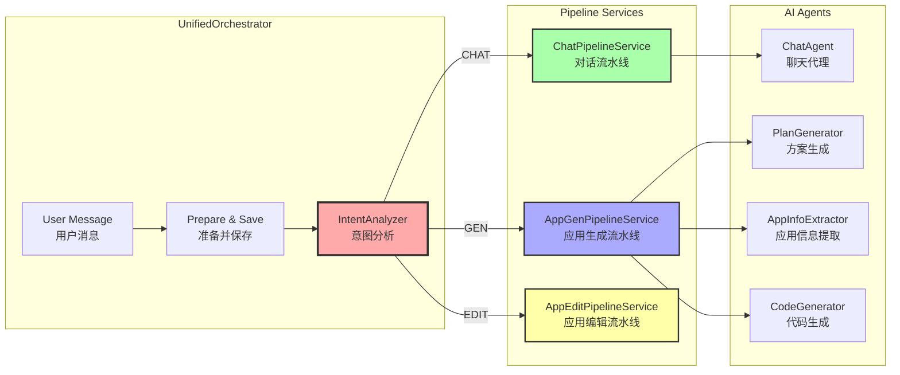
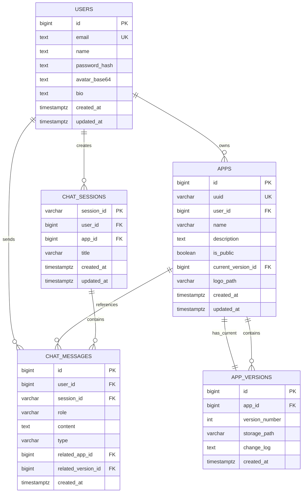
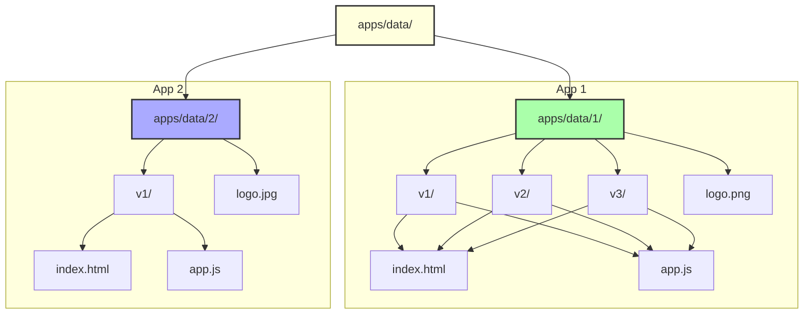
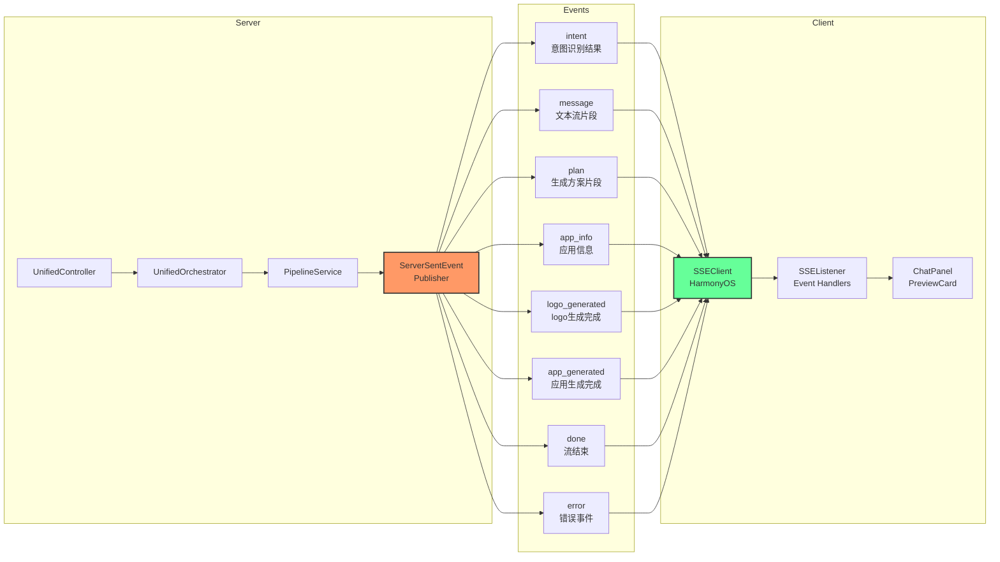

# MetaCraft 系统架构

## 1. 整体系统架构

```mermaid
graph TB
    subgraph "Client Layer - 客户端层"
        HOS[HarmonyOS App<br/>ArkTS/ETS]
        WEB[Web Browser<br/>Preview Apps]
    end

    subgraph "API Gateway Layer - API 网关层"
        SECURITY[Spring Security<br/>JWT Filter]
        MVC[WebMvcConfig<br/>API Prefix /api]
    end

    subgraph "Application Layer - 应用层"
        UNIFIED[UnifiedController<br/>POST /ai/agent/unified]
        AUTH[AuthController<br/>/auth/*]
        USER[UserController<br/>/user/*]
        SESSION[ChatSessionController<br/>/ai/sessions/*]
        PREVIEW[PreviewController<br/>/preview/{uuid}]
    end

    subgraph "Domain Layer - 领域层"
        ORCHESTRATOR[UnifiedOrchestrator<br/>统一编排器]
        INTENT[IntentAnalyzer<br/>意图识别]
        PIPELINE[Pipeline Services<br/>流水线服务]
        AGENTS[AI Agents<br/>ChatAgent/CodeGenerator<br/>PlanGenerator/AppInfoExtractor]
    end

    subgraph "Infrastructure Layer - 基础设施层"
        LANGCHAIN[LangChain4j<br/>@AiService/@Tool]
        AIProvider[AI Providers<br/>DashScope Qwen/Zhipu]
        STORAGE[StorageService<br/>文件存储]
        REPOS[(Repositories<br/>JPA)]
    end

    subgraph "Data Layer - 数据层"
        POSTGRES[(PostgreSQL<br/>users/apps/app_versions<br/>chat_sessions/chat_messages)]
        FILES[(File System<br/>apps/data/{appId}/v{version}/)]
    end

    HOS -->|HTTPS + JWT| SECURITY
    WEB -->|HTTPS| PREVIEW
    SECURITY --> MVC
    MVC --> UNIFIED
    MVC --> AUTH
    MVC --> USER
    MVC --> SESSION
    MVC --> PREVIEW

    UNIFIED --> ORCHESTRATOR
    AUTH --> USER
    SESSION --> ORCHESTRATOR

    ORCHESTRATOR --> INTENT
    INTENT --> PIPELINE
    PIPELINE --> AGENTS
    AGENTS --> LANGCHAIN
    LANGCHAIN --> AIProvider

    ORCHESTRATOR --> REPOS
    AGENTS --> STORAGE
    STORAGE --> FILES
    REPOS --> POSTGRES

    style HOS fill:#f9f,stroke:#333,stroke-width:2px
    style WEB fill:#bbf,stroke:#333,stroke-width:2px
    style LANGCHAIN fill:#bfb,stroke:#333,stroke-width:2px
    style POSTGRES fill:#ffd,stroke:#333,stroke-width:2px
```

## 2. 意图路由架构



## 3. 数据模型架构



## 4. 模块依赖关系

```mermaid
graph TB
    subgraph "controllers"
        UnifiedController
        AuthController
        UserController
        ChatSessionController
        PreviewController
    end

    subgraph "services"
        UnifiedOrchestrator
        ChatSessionService
        ChatMessageService
        AppService
        ImageService
        UserService
    end

    subgraph "pipelines"
        ChatPipelineService
        AppGenPipelineService
        AppEditPipelineService
    end

    subgraph "agents"
        IntentAnalyzer
        ChatAgent
        PlanGenerator
        AppInfoExtractor
        CodeGenerator
    end

    subgraph "security"
        JwtTokenProvider
        JwtAuthenticationFilter
        AuthUtils
    end

    subgraph "storage"
        StorageService
    end

    subgraph "repositories"
        UserRepository
        AppRepository
        AppVersionRepository
        ChatSessionRepository
        ChatMessageRepository
    end

    UnifiedController --> UnifiedOrchestrator
    UnifiedController --> AuthUtils

    AuthController --> UserService
    UserController --> UserService

    ChatSessionController --> ChatSessionService
    ChatSessionController --> ChatMessageService

    PreviewController --> AppService
    PreviewController --> StorageService

    UnifiedOrchestrator --> ChatSessionService
    UnifiedOrchestrator --> ChatMessageService
    UnifiedOrchestrator --> IntentAnalyzer
    UnifiedOrchestrator --> ChatPipelineService
    UnifiedOrchestrator --> AppGenPipelineService
    UnifiedOrchestrator --> AppEditPipelineService

    ChatPipelineService --> ChatAgent
    AppGenPipelineService --> ChatAgent
    AppGenPipelineService --> PlanGenerator
    AppGenPipelineService --> AppInfoExtractor
    AppGenPipelineService --> CodeGenerator
    AppGenPipelineService --> AppService
    AppGenPipelineService --> ImageService
    AppGenPipelineService --> ChatMessageService

    AppEditPipelineService --> CodeGenerator

    UserService --> UserRepository
    AppService --> AppRepository
    AppService --> AppVersionRepository
    AppService --> StorageService
    ImageService --> StorageService
    ChatSessionService --> ChatSessionRepository
    ChatMessageService --> ChatMessageRepository

    JwtAuthenticationFilter --> JwtTokenProvider

    style UnifiedOrchestrator fill:#f96,stroke:#333,stroke-width:3px
    style IntentAnalyzer fill:#f96,stroke:#333,stroke-width:2px
```



## 5. 文件存储结构



## 6. SSE 事件流架构



## 架构说明

### 分层架构

1. **Client Layer (客户端层)**
   - HarmonyOS 原生应用（ArkTS/ETS）
   - Web 浏览器（用于预览生成的应用）

2. **API Gateway Layer (API 网关层)**
   - Spring Security + JWT 认证
   - 统一 API 前缀 `/api`
   - 跨域配置

3. **Application Layer (应用层)**
   - RESTful API 控制器
   - 统一入口 `POST /ai/agent/unified`

4. **Domain Layer (领域层)**
   - 统一编排器协调意图识别和流水线
   - AI Agents 封装 LangChain4j 服务

5. **Infrastructure Layer (基础设施层)**
   - LangChain4j AI 集成
   - 存储服务
   - 数据仓库

6. **Data Layer (数据层)**
   - PostgreSQL 数据库
   - 文件系统（应用代码）

### 核心设计模式

1. **统一编排模式**: `UnifiedOrchestrator` 作为中心协调器
2. **意图路由模式**: 根据用户意图动态选择处理流水线
3. **流水线模式**: 每种意图对应独立的流水线服务
4. **SSE 流式模式**: 实时推送 AI 生成进度
