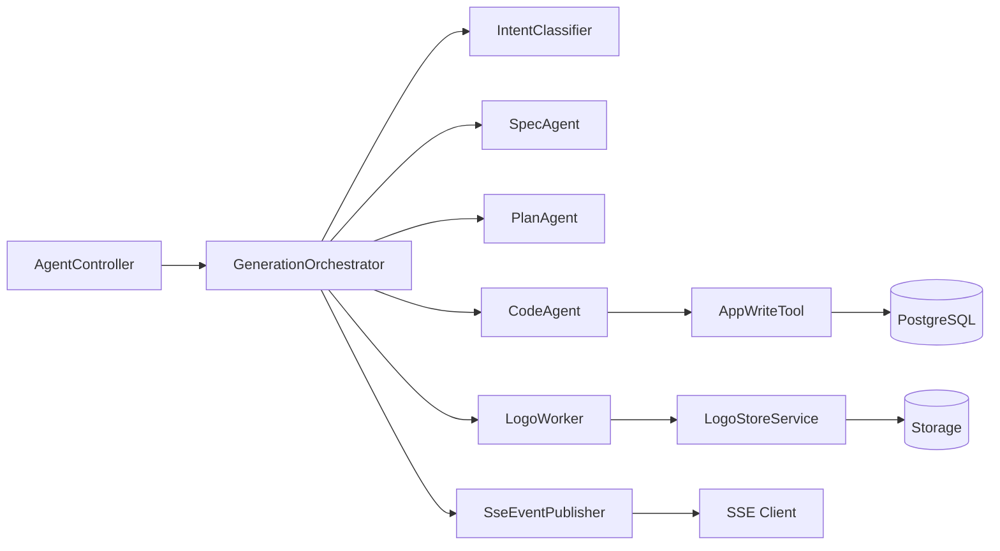

# MetaCraft 后端目标架构

## 1. 文档目标

本文档定义 MetaCraft 后端从“单一对话流”演进到“可并行、可观测、可回放”的新架构方案，重点解决以下问题：

- 生成链路职责过度集中，`AgentService` 体积持续膨胀。
- 结果绑定依赖间接查询（如 latest + logo 前缀），并发时风险高。
- Logo 异步任务不可观测，前端无法感知任务状态。
- 事件协议粒度不足，无法支撑多阶段并行生成。
- 后续从单文件 HTML 升级到多文件工程缺乏基础设施。

该方案基于你们当前技术栈（Spring Boot + LangChain4j + SSE + JPA + Flyway）设计，采用全量切换模式实施，前后端按统一新协议同步升级。

## 2. 现状评估（基于当前代码）

### 2.1 优点

- 统一入口 `POST /api/ai/agent/unified` 简洁，前端接入成本低。
- `@AiService + @Tool` 已跑通核心闭环（生成 -> 保存 -> 预览）。
- SSE 事件流基础完善，前端已有消费能力。
- `StorageService` 的路径安全校验做得正确（`normalize + startsWith`）。

### 2.2 主要架构债务

- `AgentService` 同时承担：意图识别、会话管理、消息持久化、AI 调用、结果回填、异常恢复、SSE 拼装。
- 生成成功判定不够“强一致”，存在兜底正则恢复逻辑。
- Logo 文件扩展名存在潜在不一致：存储格式可能是 `jpg/webp`，元数据固定 `.png`。
- 异步任务使用 `CompletableFuture.runAsync`，缺少统一线程池、状态机、重试与监控。

## 3. 目标原则

- 单一职责：编排、AI 能力、持久化、事件发布各自隔离。
- 强关联：每次生成必须有稳定 `runId`，所有产物都绑定 `runId`。
- 先可观测后并发：没有任务状态和指标，不开启复杂并行。
- 全量切换：新旧协议不并存，统一切到新 API 和新 SSE 事件模型。
- 可回放：任意失败请求可复盘“哪一步、为什么失败”。

## 4. 目标架构总览



### 分层说明

- `Controller 层`：鉴权、参数校验、启动编排。
- `Orchestrator 层`：维护状态机、并发调度、重试与超时。
- `AI Capability 层`：多个 `@AiService`，每个服务只负责一种输出。
- `Domain Service 层`：应用持久化、会话消息持久化、Logo 文件存储。
- `Event 层`：统一 SSE 事件协议与版本控制。

## 5. 运行模型：Generation Run

### 5.1 新核心概念

- `runId`：一次生成请求的全局唯一 ID（UUID），贯穿全流程。
- `task`：该 run 内的子任务（spec/plan/code/logo/save）。
- `artifact`：产物记录（app/version/logo/spec-json/plan-json）。

### 5.2 状态机

`generation_runs.status`：

- `CREATED`
- `INTENT_DONE`
- `SPEC_RUNNING`
- `PLAN_RUNNING`
- `CODE_RUNNING`
- `PERSISTING`
- `SUCCEEDED`
- `FAILED`
- `CANCELLED`

`generation_tasks.status`：

- `PENDING`
- `RUNNING`
- `SUCCESS`
- `FAILED`
- `SKIPPED`

## 6. AI 能力拆分（契合 LangChain4j）

### 6.1 为什么拆分

将一个超长 prompt 拆成多个小型、稳定、可测试的能力单元，降低 prompt 漂移风险，并允许并行。

### 6.2 建议的 `@AiService` 列表

- `ChatAssistantAiService`：纯聊天。
- `IntentAiService`：意图识别（新编排链路内独立能力）。
- `SpecAiService`：生成结构化规格（name/description/constraints）。
- `PlanAiService`：生成执行计划（步骤、组件、交互说明）。
- `CodeAiService`：根据 spec + plan 输出代码（初期单文件，后续多文件）。

### 6.3 关键实践（来自 LangChain4j 文档）

- 多个 AI Service 建议使用 `@AiService(wiringMode = EXPLICIT)`，避免未来多模型 Bean 冲突。
- 对 `Spec/Plan` 输出优先采用 Structured Output（JSON schema/可映射对象），减少正则解析。
- `@Tool` 参数写清楚用途与约束，保证模型稳定调用。
- 继续使用 `Flux<String>` 做用户可感知流式输出。

## 7. 并行编排策略

### 7.1 并行 DAG（推荐）

```text
intent -> [spec || plan || logo] -> code -> saveApp -> done
```

### 7.2 说明

- `spec` 与 `plan` 并行启动。
- `logo` 也并行启动，不阻塞主链路。
- `code` 等待 `spec + plan` 完成（可允许 plan 超时时降级）。
- `saveApp` 串行执行，确保版本一致性。

### 7.3 并行控制建议

- 线程池隔离：`aiPool`、`logoPool`、`ioPool`。
- 每用户并发上限：如 `maxActiveRunsPerUser = 3`。
- 全局队列背压：超限返回明确错误码和重试建议。

## 8. 新接口与 SSE 协议（全新）

### 8.1 API 入口（直接替换现有）

- `POST /api/ai/runs`：创建并启动一次生成 run，返回 SSE 流。
- `GET /api/ai/runs/{runId}`：查询 run 状态与产物摘要。
- `POST /api/ai/runs/{runId}/cancel`：取消 run。
- `GET /api/ai/sessions/{sessionId}/messages`：读取新会话消息。

### 8.2 SSE 事件（唯一协议）

- `run_started`：`{ runId, sessionId }`
- `intent`：`{ runId, intent }`
- `spec_ready`：`{ runId, name, description }`
- `plan_delta`：`{ runId, content }`
- `plan_done`：`{ runId }`
- `code_delta`：`{ runId, content }`
- `code_done`：`{ runId }`
- `logo_started`：`{ runId, logoUuid }`
- `logo_ready`：`{ runId, logoUrl }`
- `logo_failed`：`{ runId, reason }`
- `app_saved`：`{ runId, appId, appUuid, versionId, previewUrl }`
- `error`：`{ runId, code, message }`
- `done`：`{ runId }`

### 8.3 协议要求

- 所有 SSE data 统一为 JSON 对象，不再发送纯文本 data。
- 所有事件必须携带 `runId`。
- 前端仅按新事件渲染，不再解析旧 `plan/message/app_generated` 协议。

## 9. 数据库与 Flyway 迁移计划

### 9.1 新增表

`generation_runs`

- `id` BIGSERIAL PK
- `run_id` VARCHAR(64) UNIQUE NOT NULL
- `user_id` BIGINT NOT NULL
- `session_id` VARCHAR(64) NULL
- `intent` VARCHAR(16) NOT NULL
- `status` VARCHAR(32) NOT NULL
- `error_code` VARCHAR(64) NULL
- `error_message` TEXT NULL
- `created_at` TIMESTAMPTZ NOT NULL
- `updated_at` TIMESTAMPTZ NOT NULL

`generation_tasks`

- `id` BIGSERIAL PK
- `run_id` VARCHAR(64) NOT NULL
- `task_type` VARCHAR(32) NOT NULL
- `status` VARCHAR(16) NOT NULL
- `attempt` INT NOT NULL DEFAULT 0
- `started_at` TIMESTAMPTZ NULL
- `ended_at` TIMESTAMPTZ NULL
- `error_message` TEXT NULL

`generation_artifacts`

- `id` BIGSERIAL PK
- `run_id` VARCHAR(64) NOT NULL
- `artifact_type` VARCHAR(32) NOT NULL
- `ref_id` BIGINT NULL
- `content_json` JSONB NULL
- `created_at` TIMESTAMPTZ NOT NULL

### 9.2 apps 表增强建议

- `logo_uuid` VARCHAR(64) NULL
- `logo_ext` VARCHAR(8) NULL

说明：避免把 logo 路径硬编码为 `uuid.png`，改为 `uuid + ext` 组合。

## 10. 代码组织重构（建议目录）

```text
modules/ai/
  controller/
    AgentController.java
  orchestrator/
    GenerationOrchestrator.java
    GenerationWorkflow.java
  capability/
    ChatAssistantAiService.java
    IntentAiService.java
    SpecAiService.java
    PlanAiService.java
    CodeAiService.java
  domain/
    GenerationRunService.java
    GenerationTaskService.java
    ConversationPersistenceService.java
  event/
    SseEventPublisher.java
    SseEventMapper.java
  tool/
    AppWriteToolService.java
    LogoToolService.java
```

## 11. 关键接口草案

```java
public interface GenerationOrchestrator {
  Flux<ServerSentEvent<String>> start(AgentRequestDTO request, Long userId);
}
```

```java
public interface SpecAiService {
  // 建议返回结构化对象而非自由文本
  AppSpec generateSpec(@UserMessage String userMessage, @V("userId") Long userId, @V("runId") String runId);
}
```

```java
public interface CodeAiService {
  Flux<String> generateCode(
    @V("name") String name,
    @V("description") String description,
    @V("plan") String plan,
    @V("runId") String runId,
    @V("userId") Long userId
  );
}
```

```java
@Tool("Persist generated app and bind it to runId. Return app identity.")
public SaveAppResult saveApp(
  @P("run id for idempotent binding") String runId,
  @P("app name") String name,
  @P("app description") String description,
  @P("full html code") String code,
  @P("user id") Long userId,
  @P(value = "logo uuid", required = false) String logoUuid
) { ... }
```

## 12. 幂等与一致性

- 所有写操作带 `runId` 幂等键。
- `saveApp` 在 DB 层建立 `UNIQUE(run_id, task_type='save')` 或独立幂等表。
- `app_generated` 仅在当前 run 首次成功保存时发送。
- 恢复策略：服务重启后根据 `generation_runs` 中间状态继续或标记失败。

## 13. Logo 子系统重构建议

- 用 `TaskExecutor` 或 `@Async("logoExecutor")` 代替裸 `CompletableFuture.runAsync`。
- 任务状态写入 `generation_tasks`，并发布 `logo_started/logo_ready/logo_failed`。
- 按真实类型保存并回填 `logo_ext`。
- 提供 `GET /api/logo/{uuid}` 保持不变，内部按 `uuid + ext` 查找。

## 14. 可观测性与运维

### 14.1 日志

- 所有日志强制带 `runId`, `userId`, `sessionId`, `taskType`。
- 关键里程碑日志：task start/end、tool call、sse emit、error stack。

### 14.2 指标

- `generation_run_total{status}`
- `generation_task_duration_ms{taskType,status}`
- `ai_tokens_total{service}`
- `sse_clients_active`

可利用当前 `spring-boot-starter-actuator`，并按 LangChain4j 文档接入 `ChatModelListener`。

### 14.3 链路追踪（可选）

- 每个 run 生成 traceId。
- 外部模型调用、DB 操作、文件 IO 纳入同一链路。

## 15. 安全与治理

- 统一纳入 Spring Security 鉴权链路，不再保留手动 JWT 分支。
- `@Tool` 方法严格禁止默认 userId 回退。
- 对用户输入和模型输出做基础内容长度限制，防止超长 payload 打爆 SSE。
- 对 HTML 产物增加轻量安全扫描（script 片段白名单/黑名单策略）。

## 16. 分阶段落地计划（可执行）

### Phase 1：强关联与可观测（1-2 周）

- 新增 `generation_runs` 与 `generation_tasks`。
- 所有请求创建 `runId`。
- `saveApp` 返回结构化结果并写回 run 绑定。
- Logo 任务状态入库。

交付物：

- `V6__create_generation_runs_and_tasks.sql`
- `GenerationRunService`
- `Sse run_started/app_saved` 事件

### Phase 2：编排层抽离（1 周）

- 将 `AgentService` 拆为 `GenerationOrchestrator + ConversationPersistenceService + SseEventPublisher`。
- 下线旧控制器入口，切换到 `/api/ai/runs`。

交付物：

- 新增 orchestrator 包
- 删除旧 `AgentService` 聚合逻辑，按新分层落地

### Phase 3：多 AI 并行化（1-2 周）

- 引入 `SpecAiService`、`PlanAiService`、`CodeAiService`。
- 并行执行 `spec/plan/logo`，串行执行 `code/save`。
- 落地全新 SSE 协议并联调前端。

交付物：

- 新 prompts：`spec.txt`, `plan.txt`, `code.txt`
- 前端事件消费升级

### Phase 4：多文件生成能力（2-4 周）

- 从单文件 HTML 升级为文件清单（manifest）+ 并发文件生成。
- 增加构建校验与自动修复回路（编译失败 -> 定向修复）。

交付物：

- `generation_artifacts` 使用率提升
- 多文件预览/打包导出接口

## 17. 测试策略

- 单元测试：状态机迁移、幂等判断、任务重试。
- 集成测试：SSE 事件顺序与失败补偿。
- 契约测试：新 API 与 SSE 事件字段完整性、顺序与终态一致性。
- 压测：高并发下 run 创建、SSE 长连接稳定性、logo 异步吞吐。

## 18. 风险与决策建议

- `langchain4j-agentic` 模块目前实验性质，不建议作为第一阶段核心依赖。
- 第一阶段优先“自研编排层 + 现有 `@AiService`”，降低升级风险。
- 当流程稳定后，再评估引入 `langchain4j-agentic` 的 sequence/parallel builder，替换部分自研编排逻辑。

## 19. 本项目的最终推荐结论

- 架构方向：`单一 AgentService` -> `编排器 + 多能力 AI + 任务状态机`。
- 并行策略：先并行 `spec/plan/logo`，再串行 `code/save`。
- 关键抓手：`runId 强绑定`、`全新 SSE 协议`、`可观测性`、`全量切换发布`。
- 这样可以在一次架构升级中，直接达到 Cursor 类产品所需的“多阶段并行生成”后端能力基线。
