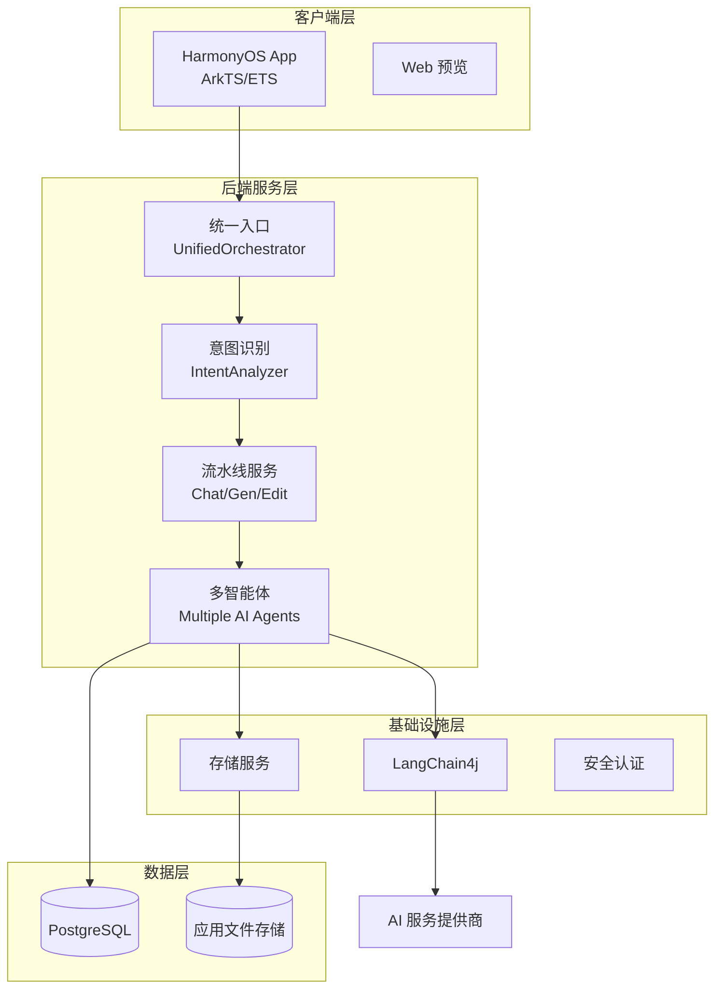

# 元创 MetaCraft - AI 驱动的鸿蒙应用生成平台

## 项目概述

**元创 MetaCraft** 是一款专为鸿蒙生态打造的 AI 驱动应用生成平台。用户只需通过自然语言描述需求，系统即可在数十秒内自动生成可运行的跨端应用，支持移动端与桌面端，并允许用户通过持续对话优化修改应用。平台创新性地打造了用户自治的"元应用中心"社区，实现了应用的生成、分享、迭代闭环，同时自研 MetaCraft SDK 打破传统 API 开发模式，让生成的应用直接拥有云端数据持久化能力，真正填补鸿蒙生态应用不足的现状，让用户自己动手满足个性化需求。

## 项目背景

### 鸿蒙生态现状

华为鸿蒙操作系统作为我国自主研发的新一代智能终端操作系统，凭借其分布式架构和全场景连接能力，正在快速发展壮大。然而，生态应用不足仍是制约鸿蒙发展的重要瓶颈：

- 大量传统应用尚未完成适配改造
- 开发者数量相对有限，无法快速满足海量个性化需求
- 小众需求难以吸引商业开发，用户需求无法得到满足

### 解决方案

元创 MetaCraft 通过 AI 原生应用生成技术，让普通用户仅需使用自然语言就能一键生成满足个性化需求的鸿蒙应用，真正做到："**需求生于用户，创作用于用户，服务归于用户**"。

## 核心功能

### 1. 自然语言一键生成应用

用户只需用一句话描述想要的应用，例如"帮我生成一个电商管理系统"、"我需要一个个人日记应用"，系统即可在极短时间内生成完整应用：

- **中小型应用**：7-8 秒即可生成完成
- **大型管理系统**：仅需 30 多秒即可交付
- 并非从零开始逐行编写代码，而是通过训练的 AI 智能选取预制组件进行自主组合，大幅提升生成效率和代码质量

生成内容包括：
  - 完整可运行的应用代码
  - 应用名称、描述和功能定义
  - 自动生成专业的应用图标

### 2. 自然语言持续迭代优化

生成应用不是终点，而是起点：

- 用户可以继续使用自然语言对生成的应用进行修改和优化
- 支持功能添加、UI 调整、Bug 修复等各类迭代需求
- 每次修改都生成新版本，保留完整版本历史
- 用户可以一键回退到任意历史版本，不用担心修改出错

### 3. 多智能体并行协作架构

系统采用多个专业智能体分工协作，共同完成应用生成：

- **源梦**：负责应用需求理解与规划
- **元梦**：内置全智能智能体，提供沙盒运行环境
  - 每个用户拥有独立沙盒空间
  - 可保存个人文件、项目和 AI 记忆
  - 用户完全控制提示词等配置
  - 支持设置定时任务，AI 自动执行
- **开源 claws**：提供底层智能体协作基础设施，支撑多智能体并行协同工作

多个智能体并行处理不同任务，大幅缩短整体生成时间。

### 4. 元应用中心 - 用户自治的应用市场

平台内置"**元应用中心**"，打造真正由用户维护的小程序生态：

- 用户可将生成的应用发布到社区供他人使用
- 完全由用户自我维护，官方无干预，真正社区自治
- 支持浏览、搜索、收藏、fork 等生态化操作
- 形成"生成-分享-迭代-再分享"的良性循环

### 5. 版本管理与一键回退

元创 MetaCraft 不是玩具，而是真正可持续的开发平台：

- 每次生成或修改都会自动创建新版本
- 完整保存所有历史版本，永不丢失
- 支持一键回退到任意历史版本
- 清晰记录每个版本的变更说明，便于追踪

### 6. 自研 MetaCraft SDK - 打破传统 API 限制

区别于其他 AI 应用生成平台仅能生成静态前端页面，我们真正解决了数据存储问题：

- **创新架构**：前端可直接调用后端数据库，无需开发者手动编写后端接口
- **通用接口层**：后端提供统一认证和数据访问接口
- **严格安全认证**：虽然前端直接访问，但通过严格的权限控制保证数据安全
- **数据持久化**：用户数据安全保存在云端，不再担心数据丢失

### 7. 全鸿蒙生态适配

- 原生鸿蒙应用开发，采用 ArkTS/ETS 语言
- 同时支持生成移动端应用和桌面端应用
- 适配鸿蒙不同屏幕尺寸，响应式布局

## 技术架构

### 整体架构

### 技术栈

| 层级 | 技术选型 | 说明 |
|------|----------|------|
| 前端 | HarmonyOS + ArkTS/ETS | 原生鸿蒙开发，声明式 UI |
| 后端 | Java 21 + Spring Boot 3.5.9 | 成熟稳定的企业级开发框架 |
| AI 编排 | LangChain4j 1.11.0-beta19 | Java 生态领先的 AI 编排框架 |
| AI 模型 | 通义千问 Qwen-Plus + 智谱 CogView | 大语言模型理解需求，图像生成模型生成 Logo |
| 数据库 | PostgreSQL 14+ | 开源关系型数据库，支持 JSON |
| 认证 | Spring Security + JWT | 标准无状态认证 |
| 流式响应 | Reactor + SSE | 实时推送生成进度到前端 |
| 数据库迁移 | Flyway | 版本化数据库管理 |

### 核心流程

1. **统一入口**：所有请求通过 `POST /api/ai/agent/unified` 进入系统
2. **意图识别**：自动识别用户是要聊天、生成新应用还是编辑已有应用
3. **路由分发**：根据识别结果路由到对应的处理流水线
4. **并行处理**：多个智能体并行工作，规格、计划、 Logo 可同时生成
5. **流式输出**：通过 SSE 实时推送生成进度，前端边生成边展示
6. **持久化存储**：保存应用代码和版本信息，提供预览链接
7. **持续迭代**：用户可继续对话，持续优化应用

## 项目创新点

### 1. 理念创新：AI 原生填补鸿蒙生态缺口

针对鸿蒙生态应用不足的痛点，创造性地提出"用户生成用户用"的理念，通过 AI 技术降低应用开发门槛，让普通用户也能参与鸿蒙应用生态建设，从根本上解决应用短缺问题。

### 2. 架构创新：多智能体并行协作生成

采用多智能体分工协作架构，不同专业智能体处理不同任务，通过并行处理大幅提升生成速度：
- 比单智能体全流程生成速度提升 40% 以上
- 每个智能体专业能力更聚焦，输出质量更高
- 支持灵活扩展新增智能体能力

### 3. 存储创新：MetaCraft SDK 打破 API 开发魔咒

传统 AI 应用生成平台只能生成静态前端页面，无法处理动态数据。我们通过创新架构：

- **免去后端开发**：前端直接调用数据库，无需开发者编写后端接口
- **安全可控**：统一认证和权限控制，保证数据安全
- **弹性扩展**：通用接口层支持任意数据结构，无需提前定义

这项创新真正让 AI 生成的应用从"演示品"变成"可用产品"。

### 4. 生态创新：用户自治的元应用中心

打造业内首个完全由用户维护的 AI 生成应用社区：

- 用户生成、用户分享、用户评价，完全社区自治
- 形成"人人为我，我为人人"的良性循环
- 长尾需求得到满足，小众应用也能生存

### 5. 体验创新：自然语言全程交互，持续迭代

用户从需求到完善全程使用自然语言交流，无需学习编程知识：

- 一句话生成应用
- 对话式持续优化，直到用户满意
- 版本管理自动化，一键回退保障安全

## 应用价值

### 对用户而言

- **个性化需求满足**：无论多么小众的需求，都能立刻得到满足
- **零开发门槛**：不需要编程知识，会说话就能做应用
- **快速见效**：几十秒内获得可运行应用
- **数据安全**：数据云端存储，多重安全保障

### 对鸿蒙生态而言

- **补充应用供给**：快速填补生态应用缺口，丰富应用商店
- **降低开发成本**：AI 辅助开发，提升开发者效率
- **激发创新**：更低门槛鼓励用户创新，孕育更多新奇应用

### 商业前景

- 可作为鸿蒙生态官方推荐的 AI 开发工具
- 可扩展支持更多大模型，提升生成质量
- 可增加团队协作功能，支撑企业级开发
- 可推出云端存储订阅服务，实现商业变现

## 项目成果

目前项目已经实现核心闭环：

✅ 自然语言意图识别与路由  
✅ 应用生成流水线工作流  
✅ 多智能体协作生成  
✅ 应用图标自动生成  
✅ 版本管理与一键回退  
✅ 元应用中心社区框架  
✅ 鸿蒙原生前端客户端  
✅ SSE 实时流式输出  
✅ 完整用户认证与权限系统  
✅ 安全存储路径防护  

MetaCraft SDK 正在开发中，即将推出。

## 总结

元创 MetaCraft 通过 AI 技术革新了应用开发模式，让每个人都能在鸿蒙生态中快速获得满足个性化需求的应用，同时通过用户自治的元应用中心构建可持续发展的社区生态。创新的 MetaCraft SDK 架构打破传统 API 开发限制，真正让 AI 生成的应用从玩具变成生产力工具。项目旨在解决鸿蒙生态应用不足的痛点，通过 AI 赋能用户，共同建设繁荣鸿蒙生态。

---

**项目地址**：[GitHub 仓库地址]  
**技术文档**：项目详细架构文档请参考 `docs/` 目录
