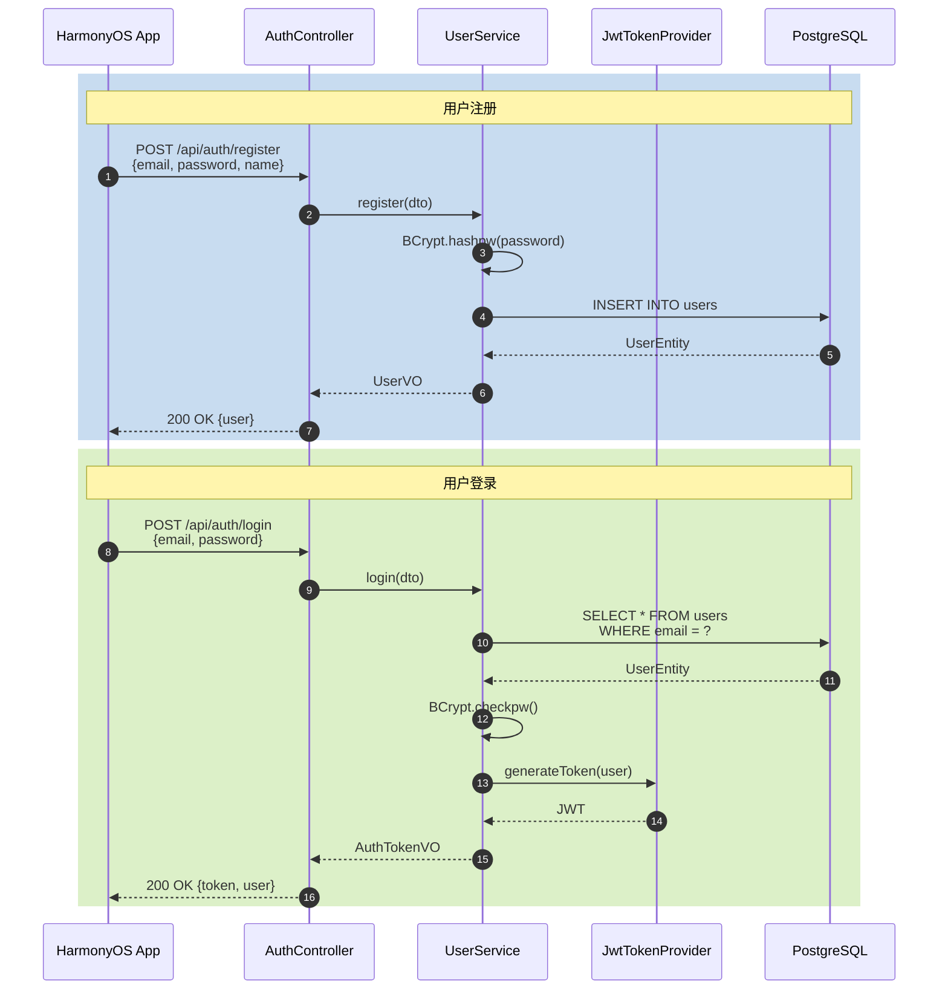
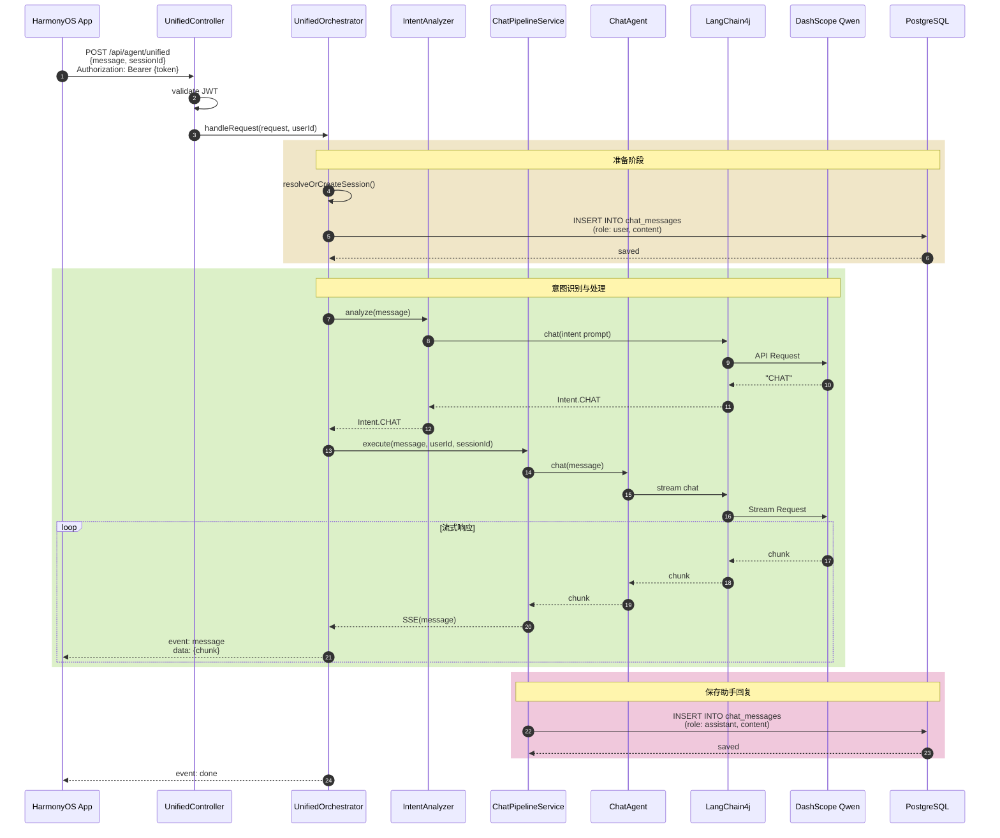
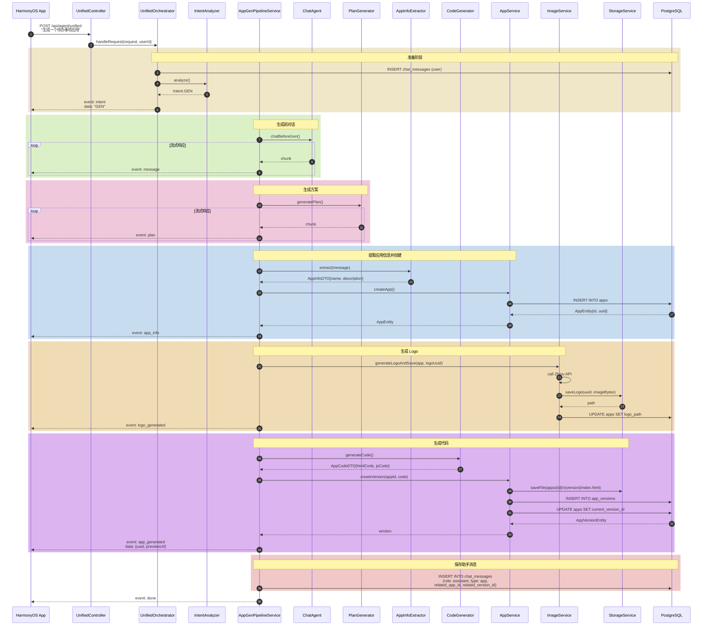
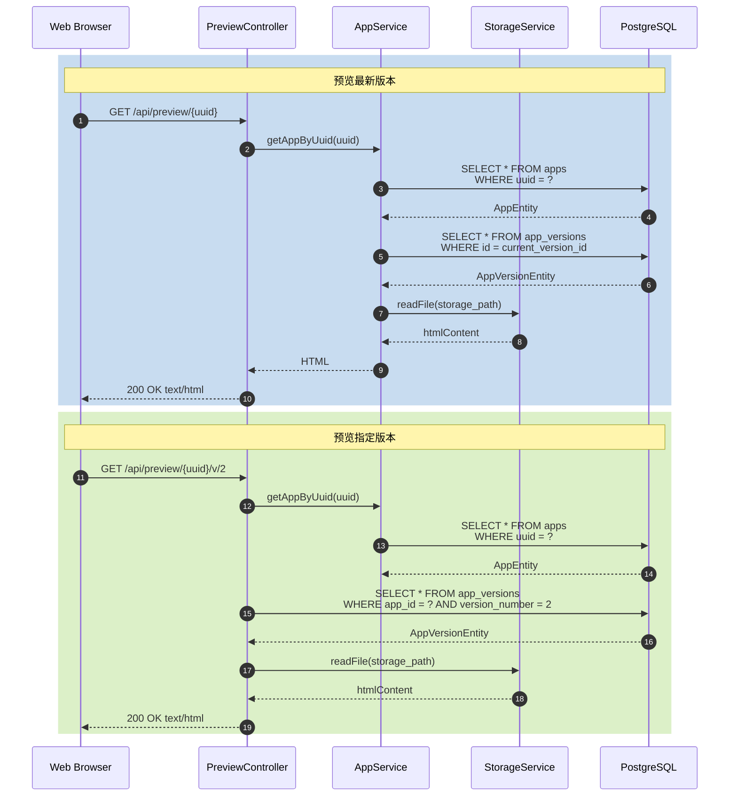
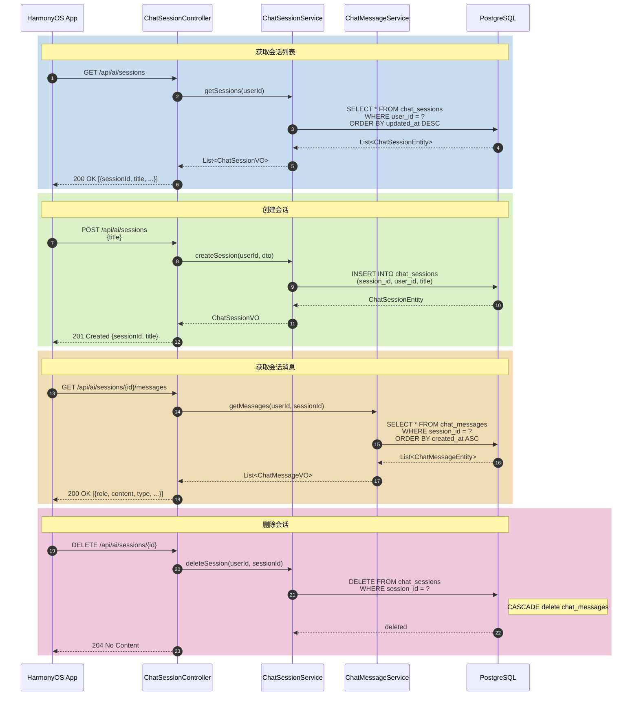
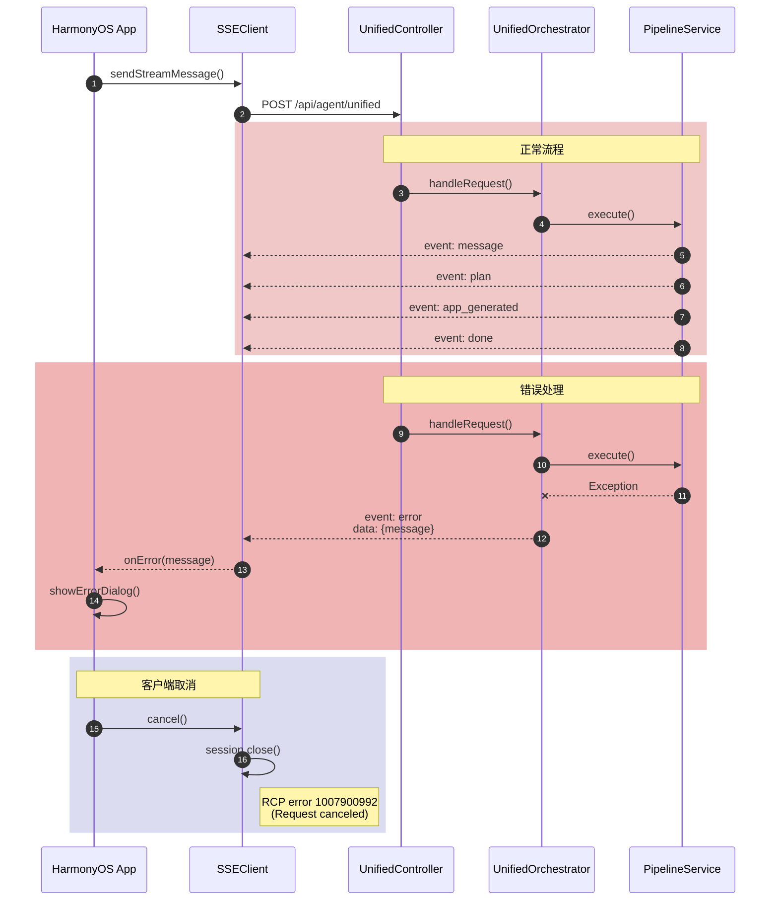
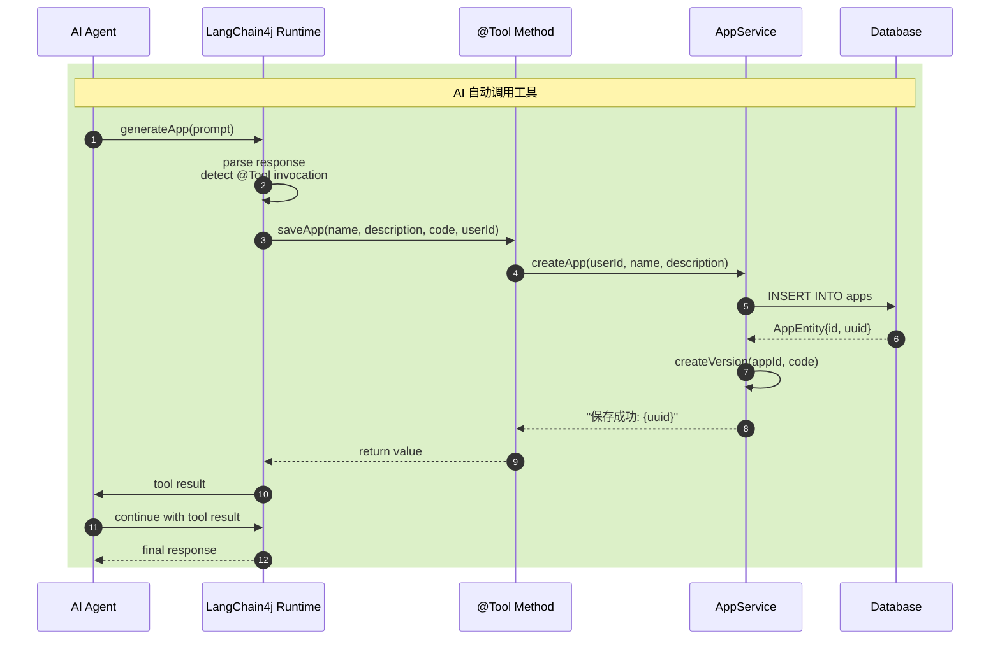

# MetaCraft 时序用例图

## 1. 用户认证流程

## 2. 统一 AI 对话流程（CHAT 意图）

## 3. 应用生成流程（GEN 意图）

## 4. 应用预览流程

## 5. 会话管理流程

## 6. SSE 连接错误处理

## 7. LangChain4j @Tool 调用流程

## 用例说明

### 核心用例

| 用例 | 入口 | 意图 | 流水线 | 主要事件 |
|------|------|------|--------|----------|
| 普通对话 | POST /api/agent/unified | CHAT | ChatPipelineService | intent, message, done |
| 应用生成 | POST /api/agent/unified | GEN | AppGenPipelineService | intent, message, plan, app_info, logo_generated, app_generated, done |
| 应用编辑 | POST /api/agent/unified | EDIT | AppEditPipelineService | intent, message, done |
| 用户认证 | POST /api/auth/login | - | - | - |
| 应用预览 | GET /api/preview/{uuid} | - | - | - |

### SSE 事件类型详解

| 事件名 | 触发时机 | 数据格式 |
|--------|----------|----------|
| `intent` | 意图识别完成 | `{"type": "CHAT\|GEN\|EDIT"}` |
| `message` | 文本流片段 | `{"content": "..."}` |
| `plan` | 方案生成片段 | `{"content": "..."}` |
| `app_info` | 应用信息提取完成 | `{"name": "...", "description": "..."}` |
| `logo_generated` | Logo 生成完成 | `{"logoUuid": "...", "ext": "png"}` |
| `app_generated` | 应用生成完成 | `{"uuid": "...", "url": "/api/preview/..."}` |
| `done` | 流结束 | `{}` |
| `error` | 错误发生 | `{"message": "..."}` |
