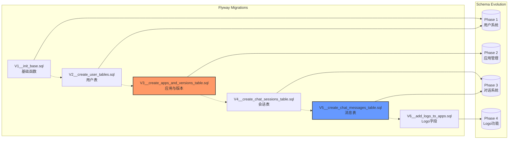
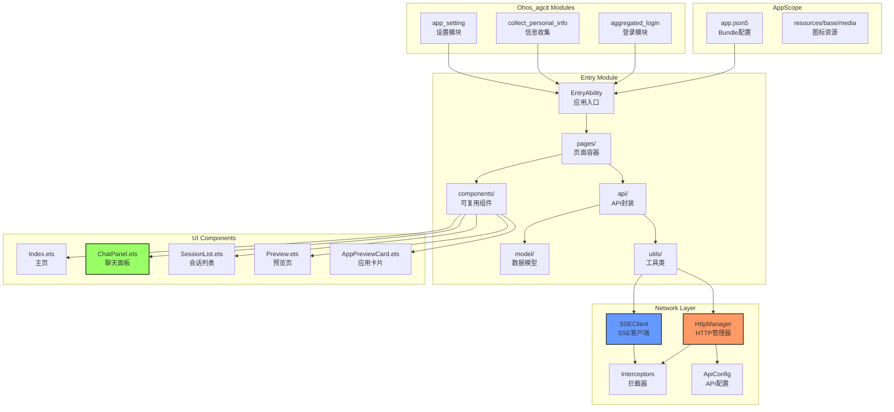
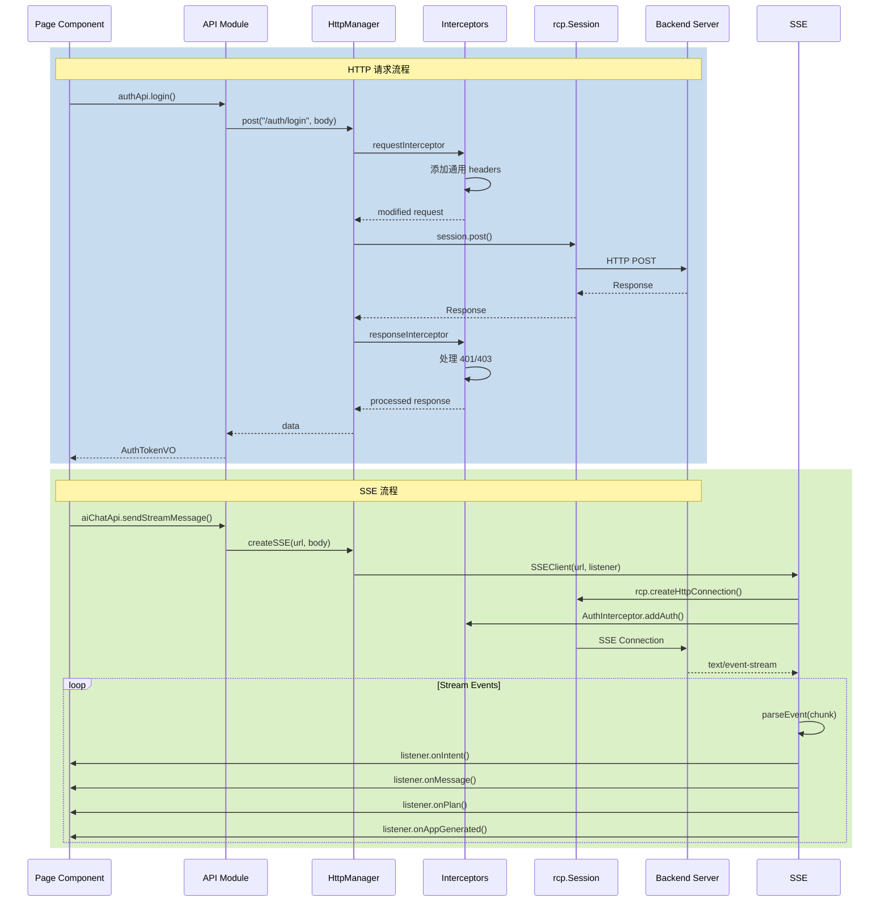
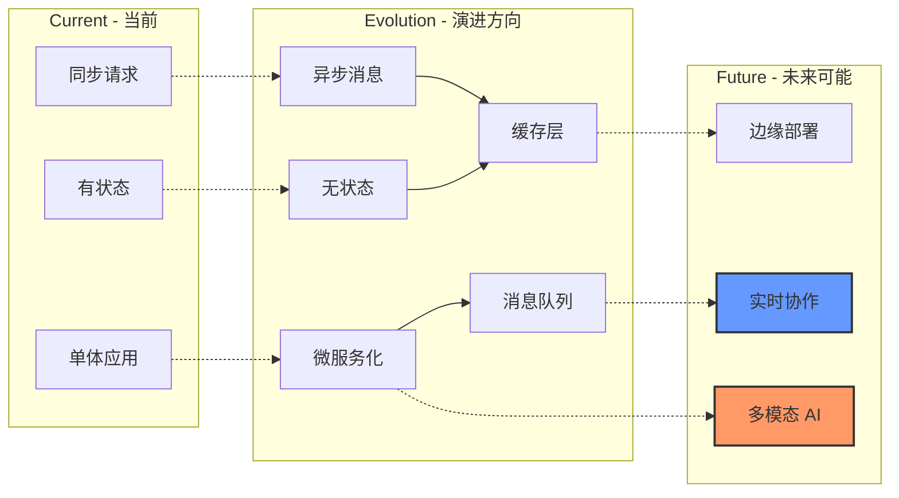

# MetaCraft 技术路线

## 1. 技术栈全景图

```mermaid
graph TB
    subgraph "Frontend - 前端技术栈"
        direction TB
        HOS[HarmonyOS]
        ARKTS[ArkTS / ETS]
        OHPM[OHPM]
        RCP[@kit.RemoteCommunicationKit]
        LV_MARKDOWN[@luvi/lv-markdown-in]
    end

    subgraph "Backend - 后端技术栈"
        direction TB
        JAVA[Java 21]
        SPRING[Spring Boot 3.5.9]
        SECURITY[Spring Security + JWT]
        JPA[Spring Data JPA]
        REACTOR[Project Reactor / SSE]
    end

    subgraph "AI - AI 技术栈"
        direction TB
        LANGCHAIN[LangChain4j 1.11.0-beta19]
        DASHSCOPE[DashScope Community Starter]
        QWEN[Qwen Plus]
        ZHIPU[Zhipu AI / CogView]
    end

    subgraph "Database - 数据技术栈"
        direction TB
        POSTGRES[PostgreSQL 14+]
        FLYWAY[Flyway Migrations]
        FS[File System Storage]
    end

    subgraph "DevOps - 开发运维"
        direction TB
        MAVEN[Maven / mvnw]
        SWAGGER[SpringDoc OpenAPI 3]
        DEVICO[DevEco Studio]
        LOMBOK[Lombok]
    end

    HOS --> ARKTS
    ARKTS --> OHPM
    ARKTS --> RCP
    ARKTS --> LV_MARKDOWN

    JAVA --> SPRING
    SPRING --> SECURITY
    SPRING --> JPA
    SPRING --> REACTOR

    SPRING --> LANGCHAIN
    LANGCHAIN --> DASHSCOPE
    DASHSCOPE --> QWEN
    LANGCHAIN --> ZHIPU

    JPA --> POSTGRES
    SPRING --> FLYWAY
    SPRING --> FS

    JAVA --> MAVEN
    SPRING --> SWAGGER
    HOS --> DEVICO
    JAVA --> LOMBOK

    style LANGCHAIN fill:#9f6,stroke:#333,stroke-width:3px
    style QWEN fill:#f96,stroke:#333,stroke-width:2px
    style ZHIPU fill:#69f,stroke:#333,stroke-width:2px
    style SPRING fill:#6f9,stroke:#333,stroke-width:2px
```

## 2. Spring Boot 架构分层

```mermaid
graph LR
    subgraph "Spring Boot Application"
        CONFIG[@Configuration<br/>配置层]
        CONTROLLER[@RestController<br/>控制器层]
        SERVICE[@Service<br/>服务层]
        REPOSITORY[@Repository<br/>数据访问层]
        ENTITY[@Entity<br/>实体层]
    end

    subgraph "Spring Security"
        JWT[JwtTokenProvider]
        FILTER[JwtAuthenticationFilter]
        CONFIG_SEC[SecurityConfig]
    end

    subgraph "LangChain4j"
        AI_SERVICE[@AiService<br/>AI服务接口]
        TOOL[@Tool<br/>工具方法]
    end

    subgraph "Reactive"
        FLUX[Flux<SSE>]
        MONO[Mono<T>]
        SCHEDULER[Schedulers]
    end

    CONTROLLER --> SERVICE
    SERVICE --> REPOSITORY
    REPOSITORY --> ENTITY

    CONFIG_SEC --> FILTER
    FILTER --> JWT

    SERVICE --> AI_SERVICE
    AI_SERVICE --> TOOL

    CONTROLLER --> FLUX
    SERVICE --> MONO
    FLUX --> SCHEDULER

    style AI_SERVICE fill:#f96,stroke:#333,stroke-width:2px
    style TOOL fill:#f96,stroke:#333,stroke-width:2px
```

## 3. LangChain4j 集成架构

```mermaid
graph TB
    subgraph "LangChain4j Components"
        AI_SERVICE[@AiService<br/>接口定义]
        IMPL[自动实现<br/>运行时生成]
        SYSTEM[@SystemMessage<br/>系统提示词]
        USER[@UserMessage<br/>用户消息]
        VARIABLE[@V<br/>变量注入]
        P_TOOL[@Tool<br/>工具调用]
        STREAMING[Flux Streaming<br/>流式输出]
    end

    subgraph "Prompt Templates"
        P1[prompts/intent.txt]
        P2[prompts/chat.txt]
        P3[prompts/gen-plan.txt]
        P4[prompts/gen-code.txt]
        P5[prompts/gen-app-info.txt]
    end

    subgraph "AI Providers"
        DASH[DashScope<br/>Qwen Plus]
        ZHIPU[Zhipu AI<br/>CogView]
    end

    AI_SERVICE --> IMPL
    IMPL --> SYSTEM
    IMPL --> USER
    IMPL --> VARIABLE
    IMPL --> P_TOOL
    IMPL --> STREAMING

    SYSTEM --> P1
    SYSTEM --> P2
    SYSTEM --> P3
    SYSTEM --> P4
    SYSTEM --> P5

    IMPL --> DASH
    P_TOOL --> ZHIPU

    style AI_SERVICE fill:#9f6,stroke:#333,stroke-width:2px
    style P_TOOL fill:#f69,stroke:#333,stroke-width:2px
    style STREAMING fill:#69f,stroke:#333,stroke-width:2px
```

## 4. 数据库迁移路线



## 5. HarmonyOS 前端架构



## 6. 前端网络层设计



## 7. 安全架构

```mermaid
graph TB
    subgraph "Authentication - 认证"
        Creds[用户凭证<br/>email + password]
        BCrypt[BCrypt 哈希]
        JWT[JWT Token<br/>HMAC-SHA256]
        TokenHeader[Authorization Header<br/>Bearer {token}]
    end

    subgraph "Authorization - 授权"
        SecurityConfig[SecurityConfig<br/>安全配置]
        PublicEndpoints[/api/auth/**<br/>/api/preview/**]
        ProtectedEndpoints[/api/agent/**<br/>/api/user/**<br/>/api/sessions/**]
        ManualValidation[AuthUtils<br/>手动验证]
    end

    subgraph "Storage Security - 存储安全"
        PathNormalize[路径归一化<br/>normalize()]
        PathValidate[路径验证<br/>startsWith()]
        UUIDAccess[UUID 访问控制<br/>防止ID枚举]
    end

    Creds --> BCrypt
    BCrypt --> JWT
    JWT --> TokenHeader

    TokenHeader --> SecurityConfig
    SecurityConfig --> PublicEndpoints
    SecurityConfig --> ProtectedEndpoints
    ProtectedEndpoints --> ManualValidation

    SecurityConfig --> PathNormalize
    PathNormalize --> PathValidate
    PathValidate --> UUIDAccess

    style JWT fill:#f96,stroke:#333,stroke-width:2px
    style ManualValidation fill:#f69,stroke:#333,stroke-width:2px
    style UUIDAccess fill:#69f,stroke:#333,stroke-width:2px
```

## 8. 技术选型说明

### 后端技术栈

| 技术 | 版本 | 用途 | 选型理由 |
|------|------|------|----------|
| Java | 21 | 基础语言 | LTS 版本，虚拟线程支持 |
| Spring Boot | 3.5.9 | 应用框架 | 成熟生态，自动配置 |
| Spring Security | - | 安全框架 | 标准 Java 安全解决方案 |
| JWT | java-jwt 4.4.0 | Token 认证 | 无状态认证 |
| Spring Data JPA | - | ORM | 标准 JPA 实现 |
| PostgreSQL | 14+ | 数据库 | 开源关系型数据库，支持 JSON |
| Flyway | - | 数据库迁移 | 版本化数据库管理 |
| Project Reactor | - | 响应式流 | SSE 流式输出支持 |
| LangChain4j | 1.11.0-beta19 | AI 集成 | Java AI 编排框架 |
| DashScope | - | AI 模型 | 通义千问 API |
| SpringDoc | 2.8.14 | API 文档 | OpenAPI 3.0 支持 |
| Lombok | - | 代码简化 | 减少样板代码 |

### 前端技术栈

| 技术 | 用途 | 选型理由 |
|------|------|----------|
| HarmonyOS | 操作系统 | 华为自研操作系统 |
| ArkTS | 开发语言 | TypeScript 变体，强类型 |
| ETS | UI 框架 | 声明式 UI |
| @kit.RemoteCommunicationKit | 网络通信 | HarmonyOS 原生网络库 |
| @luvi/lv-markdown-in | Markdown 渲染 | 第三方 Markdown 组件 |

### AI 技术栈

| 技术 | 用途 | 选型理由 |
|------|------|----------|
| LangChain4j | AI 编排 | Java 领域标准 AI 框架 |
| @AiService | AI 服务 | 声明式 AI 服务定义 |
| @Tool | 工具调用 | AI 函数调用支持 |
| DashScope Qwen Plus | 聊天模型 | 通义千问，支持长上下文 |
| Zhipu CogView | 图像生成 | Logo 生成 |

### 技术趋势



## 技术债务与改进方向

1. **缓存层**: 引入 Redis 缓存热点数据（用户信息、应用元数据）
2. **异步处理**: 应用生成耗时操作使用消息队列解耦
3. **限流熔断**: 添加 Resilience4j 保护 API
4. **监控告警**: 集成 Prometheus + Grafana
5. **日志聚合**: 使用 ELK/Loki 集中式日志
6. **前端优化**: 虚拟滚动、懒加载优化长列表性能
